# A Deep Dive on the Classical WebPKI

## How the Internet Decides Which Public Keys to Trust

*Written August 2026. Everything in this post describes the requirements, root-program policies, regulations, and ecosystem data in effect as of that date. The WebPKI changes quickly, by design, and several of the timelines described here carry future effective dates, so if you are reading this well after publication, treat it as a snapshot of how the system worked and where it was headed, not as a current-state reference.*

If you have not read it, EFF's Surveillance Self-Defense guide [A Deep Dive on End-to-End Encryption: How Do Public Key Encryption Systems Work?](https://ssd.eff.org/module/deep-dive-end-end-encryption-how-do-public-key-encryption-systems-work) is the best available introduction to public-key cryptography, and this post is written to pick up exactly where it leaves off. That guide follows Julia and César as they learn to encrypt messages to each other, discover the man-in-the-middle attack, and defeat it the honest way, by meeting in person and comparing key fingerprints. Meeting in person works between two friends. It cannot work between you and the millions of servers your browser talks to, operated by strangers, on machines you will never see. This post is about the system the Internet built for that problem. Julia and César come with us.

This post covers what I call the classical WebPKI, the system of X.509 certificates, certificate authorities, root programs, and governance machinery built up around them over the last thirty years. Classical here means a specific thing. The classical model conveys trust as a chain of signed certificates, built and validated per connection, with each signature carried on the wire. Conventional certificate chains will remain common in private PKIs. Post-quantum algorithms will be adopted inside the classical architecture, and private PKIs, where the operator controls the relying parties and the connection volumes are bounded, will run PQ-ready classical PKI indefinitely. The public web is different. At the web's scale, with billions of handshakes a day and hard latency budgets, post-quantum signature sizes make the per-connection chain model untenable, and the modern WebPKI will instead be built on Merkle Tree Certificates. [The Post-Quantum WebPKI](https://rmhrisk.github.io/pq-webpki/) is the sequel to this post, and covers that architecture in depth. To understand why it looks the way it does, you first need the system it replaces: the wire format changes, but nearly all of the governance carries forward.

Public-key cryptography can prove exactly one thing, which is that an operation was performed by the private key corresponding to a particular public key.

It cannot tell us who controls that key, what names or attributes belong with it, what the key is authorized to do, whether those claims remain valid, who was entitled to make them, or why anyone should accept them. Every one of those questions is answered outside the mathematics, by people, organizations, policies, and software making decisions about whom to believe.

Public Key Infrastructure is the machinery we built to answer those questions at scale:

> **PKI is a system for binding claims and entitlements to public keys, delegating the authority to make those bindings, and governing how relying parties decide whether to trust them.**

A certificate carries entitlements, not authorization decisions. It can say that this key is entitled to speak for this name, or belongs to this device, or was issued under this policy, but whether that entitlement is sufficient to let the holder do something is a judgment the relying application makes, by its own rules, at the moment it matters. A TLS certificate does not authorize anyone to serve traffic. It lets a browser conclude that the key on the other end is the one bound to the name it asked for, and everything after that is the application's decision. Authorization belongs outside the PKI, and systems that forget this end up freezing policy into certificates that outlive the decisions they were meant to express.

Two things follow from that definition, and both are about scope. PKI is not the web. The idea is general, and it is older and broader than anything a browser does: bind a key to some set of traits, delegate the authority to make that binding, and give relying parties a way to decide whether to believe it. PKI is also not X.509. SSH runs a public key infrastructure of its own, with its own key formats, its own certificate format, and its own trust model, and it is not alone; PGP built another, and workload and mobile-credential ecosystems have built more since. X.509 is simply the format the web settled on.

This post is about one of those systems in particular, the WebPKI that browsers and mail clients rely on, which binds keys to the DNS names and email addresses that authenticate servers and correspondents, and on which encryption on the public Internet depends. Where the article says PKI without qualification, that is what it means.

That sentence contains three distinct activities. Binding, delegating, and governing. This article is organized around them. Part I covers the machinery of keys, certificates, and the delegation structure everyone draws on the whiteboard. Part II covers the governance hierarchy that gives the cryptographic one its meaning. Almost nobody draws that one, and it is where the real trust decisions are made. Part III examines what happens when the two hierarchies diverge: misissuance, compromise, distrust, and the long struggle to make revocation work.

> **The WebPKI has two structures, and they are not the same shape. The cryptographic structure is a graph of signed delegations recording which key authorized which other key. The governance structure is a hierarchy of accountability that explains why the browser accepts that authority at all. Nearly every interesting failure in the history of the WebPKI is a story about the gap between them.**

---

# Part I. The Machinery

## 1. The Problem Cryptography Does Not Solve

Julia wants to connect securely to `example.com`.

The server hands her a public key. Cryptography can tell Julia whether the server possesses the corresponding private key. It cannot tell her whether that key is authorized to represent `example.com`. An attacker can generate an equally valid key pair and label it `example.com`, and nothing about the mathematics distinguishes the attacker's key from the legitimate one.

So the initial problem is not whether this key can encrypt or sign something. It is this.

> **Who is authorized to associate this key with this name?**

The same question recurs with every attribute we might want to attach to a key. Is this key associated with a particular email address? Does it belong to a particular organization, or a particular employee? Was it provisioned into a particular device on a particular factory line? Is it permitted to sign software that a billion machines will execute?

Cryptography establishes relationships between keys and operations. PKI establishes governed relationships between keys, claims, entitlements, and the parties who rely on them.

## 2. Fingerprints, TOFU, and the Limits of Direct Trust

Julia could verify the key herself, and this is exactly where the end-to-end encryption guide left her and César: fingerprint verification, done in person or over a channel they already trust. She might compare a fingerprint over a separate channel, scan a QR code, receive the key in person, or configure it manually from a source she already trusts. A fingerprint is a compact representation of a public key; it lets Julia compare two copies of a key without comparing every byte. But the fingerprint does not tell Julia what the correct key is. It becomes useful only when paired with an independent source of evidence, such as César reading it to her over a trusted phone call or showing it to her across a table. A fingerprint is a key-comparison mechanism, not a trust model.

Alternatively, Julia could accept the first key she encounters and remember it. This is trust on first use, or TOFU, the model SSH exposes directly. The first connection creates a remembered association between a host and a key; later connections either match it or produce a warning. TOFU provides genuine continuity, but it answers "is this the same key I saw before?" rather than "was the first key correct?" The first connection may already be under attack. Legitimate key rotation produces alarming warnings that users don't know how to investigate. Trust state has to be synchronized across every device Julia owns.

Direct verification works when two people know each other, when one administrator controls both systems, or when two organizations exchange trust anchors deliberately. The public Internet presents a different shape of problem entirely. Users connect to services they have never encountered, services have millions of users, keys rotate constantly, and the whole verification has to complete in milliseconds without anyone thinking about it. Julia cannot phone every website, and every website cannot phone Julia.

The missing element is **reusable evidence, produced by someone the relying party has already chosen to trust.**

## 3. Reusing a CA's Validation

Browsers solve the initial-trust problem by delegating defined verification functions to certificate authorities. Instead of every user independently establishing which key belongs to `example.com`:

1. A CA verifies that an applicant controls `example.com`.
2. The CA issues a signed certificate binding the name to a public key.
3. Browsers evaluate the certificate under their own rules.
4. Billions of relying parties reuse that one verification rather than repeating it.

It is tempting to call this "delegated TOFU," and the analogy has some appeal: an initial binding still has to be established somewhere, and the relying party still isn't the one establishing it. But the analogy breaks in an important place. TOFU is observation. The first key you happen to see becomes the reference, whether or not it was ever correct. CA validation is verification. The applicant must demonstrate control of the name through a defined, auditable procedure before the binding exists. What PKI actually does is narrower than either label suggests. The CA checks domain control once, by a defined method, and records the result in a signed certificate. Every relying party reuses that record instead of repeating the check. Nothing else is reused: each browser still builds its own path, validates it, and applies its own policy before accepting anything.

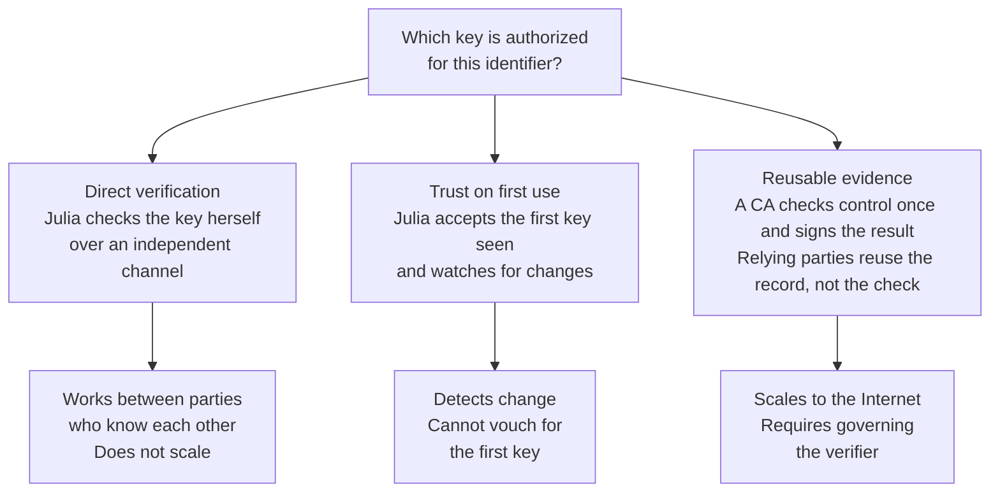

Note what the CA is not being asked. It is not deciding whether the website is honest, secure, well-run, or safe to give your credit card to. For ordinary public TLS, the delegated question is deliberately narrow:

> Did the applicant demonstrate control of this DNS name using an accepted validation method?

Keeping the question narrow makes domain validation automatable, auditable, and inexpensive enough that certificates are now issued for free. Much of the subsequent history of the WebPKI, including several of its worst failures, flows from the tension between how narrow that question is and how much weight relying parties place on the answer.

### Key lesson

> **One CA performs the domain-control check and records the result. Every relying party reuses that record while still validating the certificate and path itself. That is what makes trust scale on the web, and it is why the delegated question stays narrow: control of a name, established by a defined method, and nothing more.**

## 4. What a Certificate Actually Is

A certificate is a digitally signed binding between a public key and a set of claims and entitlements. The profile the web uses is defined in [RFC 5280](https://www.rfc-editor.org/rfc/rfc5280.html). A public TLS certificate expresses something like:

> This public key is associated with `example.com` for TLS server authentication, during this validity period, under these identified policies and constraints.

Depending on the PKI, the bound attributes may include DNS names, IP addresses, email addresses, a person's name, an organization, a device identity, a workload identity, a software publisher, the permitted uses of the key, the policy under which issuance occurred, and the period during which any of it may be relied upon. The certificate does not contain the private key; the subject later proves possession of it.

Certificates are often described as digital identity documents. That description is too narrow in a way that causes real confusion. Some certificates carry identity. Many bind keys to things that are not identities at all: roles, capabilities, devices, services, policies, operational constraints. The two orientations get conflated constantly, so name them. An identity-centric PKI binds keys to claims about who a subject is, a person, an organization, a legal entity, and everything downstream depends on how well that identity was verified. An attribute-binding PKI binds keys to identifiers, capabilities, control claims, and permitted uses, whether or not a real-world identity is present. Nothing in X.509 requires identity. The format binds attributes, and identity is one family of claims it can carry. The identifiers the WebPKI actually works with share a specific property: they are reachable. You can send a challenge to a DNS name or an email address and get an answer back. You cannot send a challenge to a person's name, which is one reason the Distinguished Name, inherited from a global directory that never materialized, carries so little weight in modern validation. The public web illustrates the difference. The overwhelming majority of TLS certificates issued today have an essentially empty subject, no person and no organization, nothing but domain names in the Subject Alternative Name extension. That is an attribute binding in its purest form, an identifier and a control claim with no identity present. Identity can be layered on where it is wanted, as OV and EV certificates do, but on today's web it is an addition, not the foundation. X.509 also defines a separate attribute-certificate format that carries no public key at all, which is a different mechanism from the distinction being drawn here.

The meaning of a certificate depends on which attributes are present, how they were validated, which policy governs them, what the issuer was authorized to assert, and how the relying application interprets the result. The same X.509 structure carries all of these meanings. The structure tells you almost nothing about the semantics.

The contents of a certificate are best organized around questions rather than field names.

* What attributes are bound? Subject Alternative Names (DNS names, IPs, email addresses), subject information, other identity or authorization extensions
* What key is bound? Subject Public Key Info: algorithm, parameters, the key itself
* Who made the binding? Issuer name, Authority Key Identifier, and the signature itself
* When may it be relied upon? Not Before, Not After
* What may the key be used for? Key Usage, Extended Key Usage, Certificate Policies
* What constraints apply? Basic Constraints, Name Constraints, path-length and policy constraints
* Where is supporting information? Authority Information Access, CRL Distribution Points, embedded Certificate Transparency evidence

If you want to see those fields in a real certificate rather than a list, [x509.io](https://x509.io/) will decode one for you, including the extensions most tools skip. It is a viewer I maintain, and it parses entirely in the browser, so nothing you paste into it leaves your machine.

Almost everything on that list beyond the key and the names lives in the certificate's extensions, and it helps to see that every extension is doing one of two jobs. Some extensions enrich, adding context about the subject associated with the key, such as the alternative names it goes by, the policies it was issued under, and where to find supporting information about it. Other extensions constrain, scoping the key within the uses and entitlements delegated to it through its issuer, as Key Usage, Extended Key Usage, Basic Constraints, and Name Constraints do. The enriching extensions tell a relying party more about what the binding means. The constraining extensions tell it how far the binding reaches. The distinction matters because the two kinds fail differently. A missing or wrong enrichment produces a certificate that misdescribes its subject, while a missing or wrong constraint produces a key with more delegated authority than anyone intended, and Part III includes an incident built on exactly that. Section 6 takes up the constraining side in detail.

### Key lesson

> **A certificate is a signed, scoped, time-bounded binding of claims and entitlements to a public key. The signature proves the issuer made the binding. Whether the binding deserves reliance depends on the issuer's authority, the policy it issued under, and the relying party's own rules.**

## 5. Roots, Subordinates, and Issuers

The term "certificate authority" is used loosely to mean at least six different things: a legal organization, a root certificate and key, an intermediate certificate and key, an issuing certificate and key, an issuance system, or the organizational function that approves requests. These are related but not interchangeable, and a lot of confused analysis traces back to conflating them.

A **CA organization** is the legal and operational entity accountable for the certificate lifecycle: the policies, the keys, the audits, the incident reports, and the answers it owes root programs. Accountability is not the same as performance. Some functions, validation in particular, may be carried out by delegated parties under controlled conditions, and the organization still answers for them.

A **root CA** is a CA the relying party trusts directly. In the WebPKI that trust is normally provisioned as a root certificate shipped in a root store, but the trust anchor is the relying party's configured acceptance of that key and its associated constraints, not anything the certificate's own self-signature establishes. The distinction matters later, when we look at what happens as roots expire.

A **subordinate CA** holds authority delegated below a trust anchor. Position and role are separate questions: some subordinates exist to delegate further, while a **leaf-issuing CA** is whichever subordinate directly signs subscriber certificates, making it the most operationally active and exposed. One CA organization typically operates several roots and many subordinates as internal segmentation of authority and operations. That is the common shape but not the only one. Subordinate CAs are sometimes operated by a different organization entirely, and Part III returns to why that arrangement is now rare and heavily constrained.

The analogy I use for this is passports. The root is the State Department: the authority whose seal the rest of the world has decided to recognize, and which almost nobody interacts with directly. The local passport office is the registration authority, the RA function in PKI terms. It is where you actually show up with your birth certificate and your photo; it checks your evidence against the rules, but it does not print passports and its judgment is only meaningful because the State Department stands behind the process. The passport itself is the certificate: a signed, expiring binding of claims and entitlements to a person, issued under the authority's rules rather than the subject's. And the border agent in another country is the relying party. The agent has never met you, never met your passport office, and never met the State Department. The agent relies on a chain of delegated verification, and on their own government's prior decision about which countries' passports to accept at all. That last decision, made far away from any individual border crossing, is the root program.

One more role rounds out the analogy, and PKI historically had a name for it, the **validation authority**, or VA. A passport in hand does not tell the border agent whether it has since been reported lost or stolen, or revoked by the issuer as fraudulently obtained. That requires an online check back against the issuer's records at the moment of presentation. The VA was the PKI function that answered exactly that question about certificates, most familiarly as the OCSP responder. Keep the term in mind for Part III, because the fate of the VA function, the discovery that the whole Internet cannot phone the issuer on every connection, is one of the classical WebPKI's defining stories.

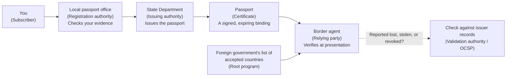

Two caveats about the analogy. It explains the governance relationships rather than the full hierarchy: the State Department stands in for both the trust anchor and the authority that issues, with no clean counterpart for the subordinate CAs that do the actual signing. And the consequences differ. A passport office that repeatedly accepted bad birth certificates would be quietly fixed by its parent agency, while a CA that does the equivalent is investigated in public and can lose recognition in one or more major root programs, which in practice can mean losing the trust of most of the Internet at once. Part III is about that difference.

Why segment at all? A PKI could use one key to sign everything. Mature PKIs don't, because the key trusted most broadly and for the longest time should not also be exposed to routine online issuance.

Roots preserve long-lived trust. A root key may be trusted for decades, and replacing it requires updates across browsers, operating systems, appliances, embedded devices, and enterprise trust stores, some of which will never be updated. Because a root compromise can take down an entire hierarchy, root keys are kept offline, used rarely and ceremonially, protected by strong physical and logical controls with separation of duties, and used almost exclusively to authorize subordinate CA keys.

Issuers, by contrast, exercise narrow authority in operational systems. Leaf-issuing keys, and sometimes other subordinate keys, live in the systems that validate requests, issue and renew certificates, and process revocations, which means they are exposed to those systems' failure modes. Not every subordinate is online: a policy CA sitting between the root and the leaf-issuing tier is often kept offline alongside the root, and only the tier that signs subscriber certificates has to be reachable at all. When an issuing key or issuance pipeline fails, the issuer can be revoked and replaced without touching the root that every device on the planet has burned into its trust store.

### Key lesson

> **Roots are trusted because relying parties already carry them, which is why they stay offline and sign almost nothing. Issuers do the daily work and carry the daily risk. The split exists so an operational failure can be contained without touching what every device on the planet already has installed.**

## 6. Constraining Delegated Authority

An intermediate or issuing CA should not automatically inherit every permission associated with the root above it. Its authority can be limited, and increasingly must be limited, to a subset of the root's trust scope: particular certificate purposes, particular namespaces, particular policies, particular customer populations, particular algorithms, a limited depth of further delegation.

Several mechanisms express or enforce these limits.

* Basic Constraints identifies whether a certificate may act as a CA at all, and can cap the number of CA levels beneath it.
* Key Usage, specifically `keyCertSign`, indicates a key may be used to verify signatures on certificates.
* Extended Key Usage, when present in CA certificates and correctly processed, constrains the purposes of everything issued beneath: TLS server authentication, client authentication, email protection, code signing, timestamping.
* Certificate Policies associate the path with defined issuance policies and assurance frameworks.
* Name Constraints restrict the namespaces beneath an intermediate, for instance limiting it to `example.com` and its subdomains.
* Path and policy constraints govern policy mapping, required policies, and permitted delegation depth.

Composed on a real chain, these mechanisms produce a progressive narrowing: each delegation hands down less authority than it received, until the subscriber certificate at the bottom can do exactly one job.

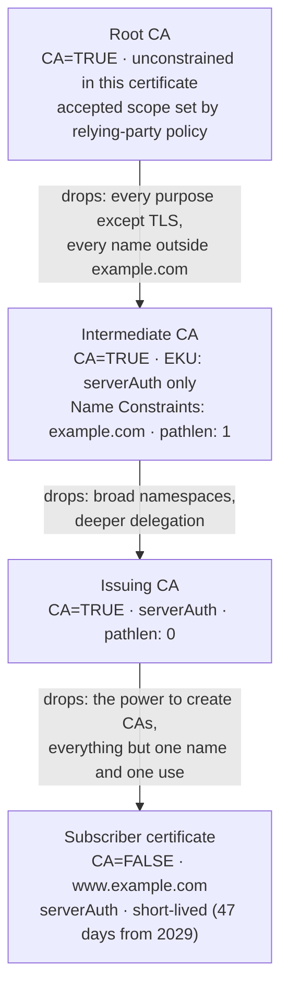

And then there is everything not encoded in certificates. Root-program policy, CA/Browser Forum requirements, certificate policies and certification practice statements (which [matter more than most people think](https://unmitigatedrisk.com/?p=1038)), contracts, issuance-system configuration, HSM controls, and administrative boundaries. A restriction that exists only in a policy document is only as strong as the oversight that enforces it. We will return to that in Part III.

One structural note on where the ecosystem is heading, because the shape of these hierarchies is changing. The diagram below shows the traditional shape: one root, one intermediate, and separate TLS and S/MIME issuers fanning out beneath it, a single trust anchor serving several purposes at once. This is how most established CAs were actually built, and much of the installed base still looks like it.

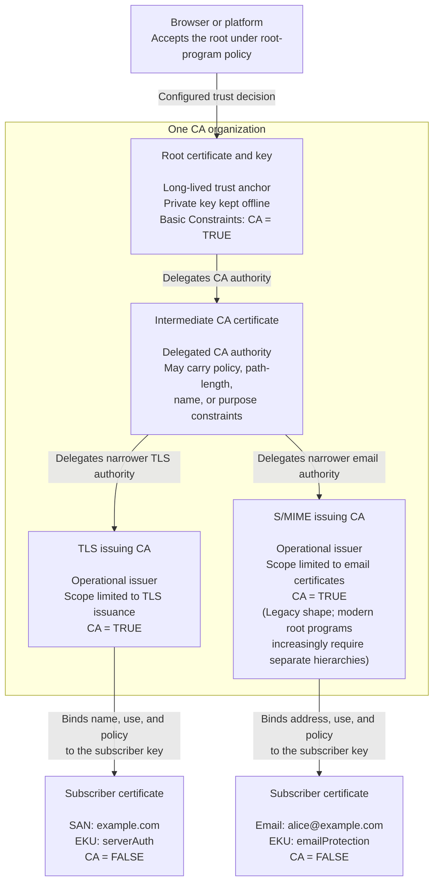

The modern shape is different, and the change is being driven from the top of the governance hierarchy. Chrome requires dedicated TLS hierarchies for inclusion, Apple is driving the same direction, and the practical consequence is one root per issuance use case: a root that anchors public TLS anchors public TLS and nothing else, with S/MIME, code signing, and every other purpose living under their own separate roots. The goal is blast radius. Each dedicated hierarchy creates a distinct cryptographic and policy boundary, so a key compromise, a profile failure, or a purpose-specific distrust decision can be contained at that hierarchy's edge instead of entangling every other thing the organization does. Shared validation services, administrators, HSMs, issuance software, and other operational dependencies can still couple the real blast radius across hierarchies, a point Part III returns to. Simplicity is the other half of the argument: one purpose per root means simpler profiles, simpler audits, simpler path processing, and fewer places for surprise to hide. If the structure must have a joint, have one joint and keep it well oiled. Simple is best.

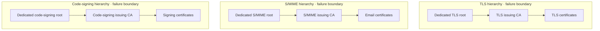

### Key lesson

> **Constraints on delegated authority come in three forms. They can be encoded in the certificate and enforced during path validation, written into policy and enforced by oversight, or built into the issuance systems themselves. Only the first is something a relying party can check for itself.**

## 7. How a Certificate Is Issued

Before the flow, a word about what the CA is actually looking at, because "control of the name" is doing more work than it appears to. Control of a DNS name is not a fact the CA can look up. It is the end of a chain: a registry delegates a zone to a registrar, the registrar maintains a registration for a registrant, the registrant's account may be held by one party while the DNS is operated by another, the web service answering the challenge may be run by a third, and the ACME client requesting the certificate by a fourth. The CA sees the last link only. It does not establish who owns the name, who paid for it, or who is entitled to it. It observes that someone was able to make the required response appear at one point in that chain, at one moment, from the vantage points the CA used.

That is the honest description of what a public TLS certificate rests on, and it explains the shape of the attacks later in this post. Compromise the registrar account, hijack the DNS, or bend the route the validation traffic takes, and you have not defeated the CA's cryptography. You have inserted yourself into the provenance chain at a point the CA cannot see and does not audit.

The issuance flow, in its timeless form:

1. **Key generation.** The subscriber generates a key pair, ideally where the private key will live, never exporting it unnecessarily.
2. **Request.** The subscriber requests a certificate binding claims and entitlements to the public key for a defined purpose.
3. **Proof of possession.** The subscriber demonstrates possession of the private key, so nobody can obtain a certificate for a key they don't control.
4. **Validation.** The CA verifies the required claim. For public TLS, that means control of a DNS name or IP address; in other PKIs it may be an email address, a legal identity, device provenance, or publisher authority.
5. **Policy evaluation.** The request is checked against the certificate profile, the certificate policy, the CPS, root-program requirements, and the Baseline Requirements.
6. **Issuance.** The issuing CA signs the certificate.
7. **Logging.** For public TLS, the certificate, or in modern practice a corresponding precertificate whose resulting SCTs are embedded in the final certificate, is submitted to Certificate Transparency logs. This is no longer optional, as we'll see in Part II.
8. **Deployment.** The subscriber installs the certificate alongside its private key.

Ten years ago, describing this flow meant describing a mixture of web forms, emails, and humans. Today, for the overwhelming majority of public TLS issuance, every step is a protocol. **ACME**, defined in [RFC 8555](https://www.rfc-editor.org/rfc/rfc8555.html), born at Let's Encrypt and now spoken by essentially every serious CA and client, turned validation and issuance into an automated conversation. In the familiar TLS case, the CA presents a challenge (place this token at this well-known URL, or in this DNS record), the applicant's software satisfies it, and a certificate appears seconds later with no human in the loop.

Two misconceptions about ACME need correcting, because both shrink the protocol down to its most visible use.

The first is that ACME means domain-control validation. Domain control is the most common challenge, not the definition. ACME is a framework for composing evidence requirements, and the ACME server, acting as the registration authority, can demand that one or more preconditions be satisfied before issuance. Those preconditions can be about the identifier, as with the DNS and HTTP challenges. They can also be about the key itself. The [ACME device attestation extension](https://datatracker.ietf.org/doc/draft-ietf-acme-device-attest/), a standards-track draft I co-author, adds identifier types for a device's permanent identifier and its hardware module, along with a `device-attest-01` challenge that carries an attestation statement from the device. The server verifies that statement against the manufacturer's attestation authority, so "this key was generated in a secure element on this specific managed device" becomes a checkable precondition of issuance rather than a policy hope. The draft is aimed primarily at enterprise PKI, which is another reminder that ACME is not a public-web protocol. And they can be about the requester: external account binding ties an ACME account to a pre-shared key provisioned out of band, and deployments can gate enrollment on identity established through OIDC or other federation, so that the conversation begins with "prove who you are" before any identifier challenge is offered. The RA composes the policy; ACME is the conversation through which the evidence is collected.

The second misconception is that ACME is a public-PKI protocol. It grew up at Let's Encrypt, so people equate it with public TLS, but nothing in the protocol depends on public trust. Enterprise and device PKIs use the same protocol to enroll workloads, laptops, and phones against private CAs, with identifier types and challenge sets tuned to their own policies. The identifiers do not have to be DNS names, and the trust anchors do not have to be in anyone's browser.

To make the composition concrete, the exchange below shows one ACME conversation gathering three kinds of evidence before anything is issued. The client first authenticates its account, with a pre-shared external account binding key or an identity established through federation, so the server knows who is asking before any authorization begins. The order then references two required authorizations rather than one: an authorization for the device identifier, satisfied through the device-attest-01 challenge, and an authorization for the DNS identifier, satisfied through dns-01. The device satisfies its authorization by having its secure element sign a statement over the newly generated key, which the server verifies against the manufacturer's attestation roots, proving the key is hardware-bound. The familiar part comes last. The DNS record is placed and checked, from multiple network perspectives when the issuance is public, and confirmed. Issuance waits until both authorizations are valid, and domain control was one authorization among several, not the protocol.

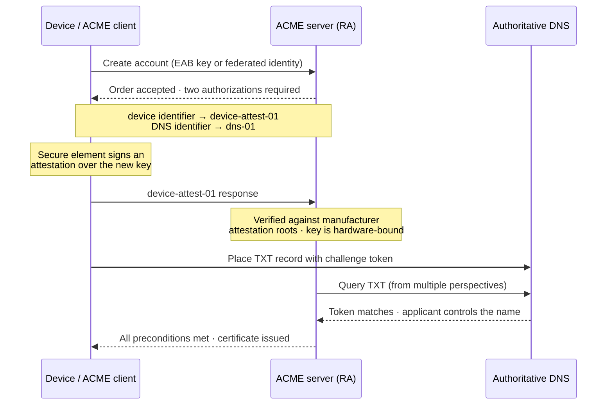

Even confined to public TLS, ACME's arrival is the single largest structural change in the WebPKI's history, and it changed three things at once. It made certificates effectively free, which ended the era in which encryption was a premium feature. It made short certificate lifetimes operationally tolerable, which, as Part III will show, is becoming the ecosystem's answer to its oldest unsolved problem. And it moved the attack surface. When validation is an automated network protocol, the interesting attacks are no longer against the CA's back office but against the network path the validation traverses. One piece of infrastructure needs a proper introduction before the attack makes sense, because everything below the web depends on it. The Internet is not one network but tens of thousands of them, and BGP, the Border Gateway Protocol, is how those networks tell each other which addresses they can reach. It is old, it is essential, and it was designed for a smaller and more trusting Internet. Routers largely accept the announcements they hear, and when two announcements cover the same addresses, the more specific or better-positioned one wins. A network that announces address space it does not own can therefore pull other people's traffic toward itself, and that is a BGP hijack. Aim one at the addresses a CA's validation traffic travels to, and the CA's question about domain control gets answered by whoever bent the route.

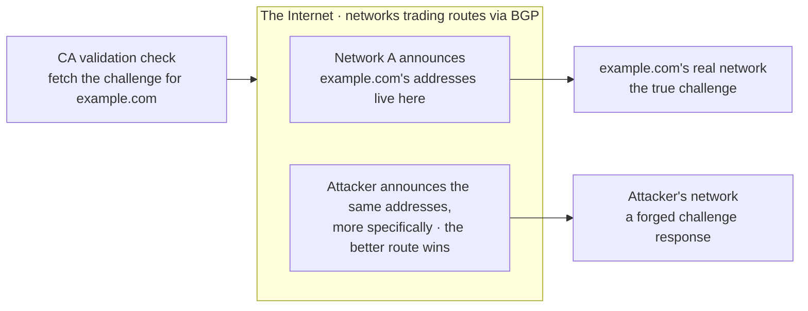

Researchers demonstrated in [controlled real-world experiments](https://www.usenix.org/conference/usenixsecurity18/presentation/birge-lee) that BGP hijacks could redirect a CA's validation traffic and yield publicly trusted certificates for domains the requester did not control. The [2018 Amazon Route 53 hijack](https://blog.cloudflare.com/bgp-leaks-and-crypto-currencies/) against MyEtherWallet showed that attackers were willing and able to manipulate global routing and authoritative DNS in practice, though that attack presented a self-signed certificate and relied on users clicking through browser warnings rather than on tricking a CA into issuing one. Put the two together and the threat was concrete: the routing manipulation was happening in the wild, and the research showed it could be aimed at validation. The ecosystem's response is a clean example of research becoming requirement, and the same Princeton group drove most of the arc. After the attack paper, they designed multi-vantage-point domain validation and [deployed it in production with Let's Encrypt in 2020](https://www.usenix.org/conference/usenixsecurity21/presentation/birge-lee), where it secured over half a billion issuances in its first year, and [follow-on measurement work](https://www.usenix.org/conference/usenixsecurity23/presentation/cimaszewski) quantified how much resilience the vantage points actually buy against real-world routing. From there the technique entered the Baseline Requirements as **multi-perspective issuance corroboration (MPIC)**: the determination made from the CA's primary perspective must be corroborated by a quorum of geographically and topologically distinct remote perspectives. As of August 2026 that means at least four remote perspectives, of which one may fail to corroborate, with the corroborating perspectives spanning at least two Regional Internet Registry regions, so a forged answer must defeat the quorum rather than bend a single path. MPIC comes up again in Part II as an example of how this ecosystem changes its own rules.

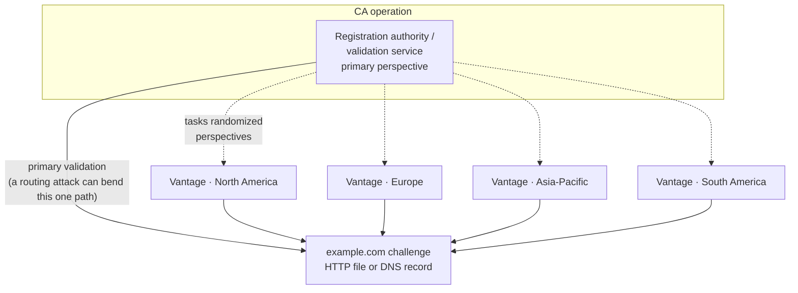

### Key lesson

> **The signature records the issuer's decision. The validation process is the basis for it. Automation did not change that relationship, it moved the basis onto the network, where it can be attacked.**

## 8. A Certification Path Is a Series of Bindings and Delegations

A certification path should not be described as merely a sequence of signatures. Each CA certificate in the path does two things. It **binds** claims, entitlements, and constraints to a subordinate public key, and it **delegates** some portion of the issuer's authority to that key. Each link answers four questions. Which key is being authorized, what is bound to it, what authority is conveyed, and what restrictions apply. A path carries authority downward by progressively binding narrower attributes and constraints to subordinate keys.

Two distinct operations turn a pile of certificates into a trust decision.

Path building, the subject of [RFC 4158](https://www.rfc-editor.org/rfc/rfc4158.html), constructs candidate paths from the subscriber certificate to some accepted trust anchor. This sounds trivial and is not. Intermediates go missing, cross-certificates create multiple parents for the same key, alternate roots exist for compatibility, and different relying parties can legitimately build different paths from the same served chain.

Path validation evaluates whether a candidate path is acceptable: signatures, validity periods, CA authorization, Basic Constraints, Name Constraints, Key Usage, EKU, policies, algorithms, path length, and application-specific requirements.

To see why the distinction matters, look at September 30, 2021. On that day the DST Root CA X3 certificate expired. This was the elderly root that had cross-signed Let's Encrypt's ISRG Root X1 so that old devices would trust Let's Encrypt. Let's Encrypt made a deliberate and controversial choice: keep serving a chain that terminated in the expired root, because Android's path validation ignores the expiry of certificates it holds as trust anchors, and tens of millions of un-updatable Android phones would keep working. Modern clients were expected to build a shorter path directly to ISRG Root X1, which they already trusted, and ignore the expired tail. Modern clients did. But a long tail of older validators, most famously anything linked against OpenSSL 1.0.2, built the one path to the expired root, failed validation, and broke, taking down monitoring agents, payment terminals, and embedded systems across the Internet. Same served chain; different path builders; opposite outcomes.

### Key lesson

> **Finding a path is not validating it, a valid path is not necessarily an acceptable one, and which path gets built is a property of the relying party rather than the server.**

## 9. Chaining Is Graph Search, Not Name Matching

The naive understanding of chaining runs something like this. Take the server's certificate, find the certificate whose subject name matches its issuer name, repeat until you reach a root, and check the signatures along the way. That model is how chaining is usually taught, and it describes only the simplest deployments. The reality is that the certificates in the ecosystem form a graph, and a chain is just one path through it that a particular validator found and preferred.

The graph arises because nothing makes the name-and-key pairing unique. The same CA subject name and the same CA key can appear in many certificates at once. A CA's long-lived certificate is reissued over its life: same name, same key, but new versions with extended validity, corrected extensions, or a stronger signature algorithm, all circulating simultaneously in caches, servers, and trust stores. Cross-certificates add more: a second issuer asserts the same subject key under its own authority, giving that key an additional parent in a different part of the forest. Issuer-to-subject name matching therefore returns multiple candidates, and even key identifiers do not resolve the ambiguity, because the whole point is that it is the same key. Path building is graph search. The validator discovers edges from the presented chain, from its own caches and stores, and by chasing Authority Information Access pointers, then evaluates candidate paths with weights and heuristics: prefer unexpired edges, prefer paths that terminate in an anchor this relying party actually trusts, prefer stronger algorithms, prefer shorter paths, retry alternatives when a preferred path fails validation. Different implementations weight differently, and the September 30, 2021 breakage in the previous section is exactly what it looks like when they do: one graph, several paths, and validators that disagreed about which path to walk.

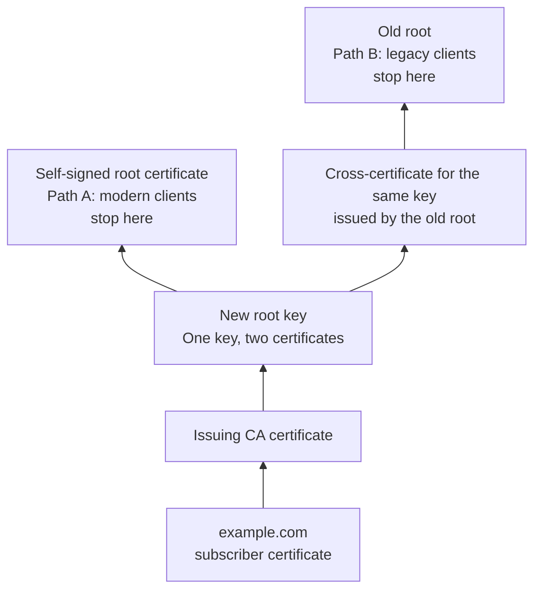

The prioritization is where the choice actually gets made. Path builders commonly rank candidate branches so that paths considered more likely to validate are attempted first. The factors and their weights are implementation-specific, and may include which anchors are locally trusted, expiration, algorithm policy, constraints, path length, cached intermediates, and other local preferences. The same graph therefore yields different chains for different relying parties, because the ranking depends on inputs only the relying party has, above all which anchors sit in its own store. A modern client tries the fresh, strong path first and stops at the new root. For a legacy client that path leads nowhere, since the anchor is not in its store, so it walks the older cross-certificate instead. Both paths may be valid, while different relying parties discover, prefer, or accept different ones because their anchors and policies differ.

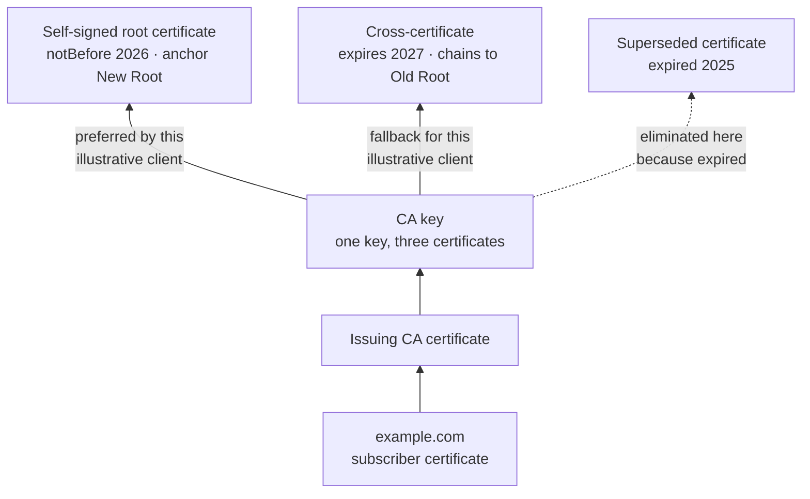

Cross-certification is the deliberate use of this graph structure, and it shows up in three recurring patterns.

The first pattern is ubiquity for new entrants. A brand-new root is nearly useless on the day it is created, because trust-store distribution takes years: old operating systems, old phones, and embedded devices will never learn it. The fix is a cross-certificate from a root that is already everywhere. The new CA's key gets a second parent in an established hierarchy, old relying parties build paths through the cross-certificate, new relying parties build paths directly to the new root, and the cross-certificate is retired once the new root has propagated. Let's Encrypt bootstrapping on a cross-sign from an established root, met earlier in this article, is the best-known example, and every serious new entrant to the WebPKI has done some version of it.

A subtlety underneath that pattern explains why the trick works at all, and why it sometimes doesn't. A root's authority does not come from the root certificate. It comes from the store the certificate sits in. The trust decision was made when the vendor added it, and the certificate is a technical anchor recording that decision, which is why a self-signed certificate proves nothing on its own. Some widely deployed verifiers take that literally and ignore the notAfter date on a trust anchor entirely, treating it as good for as long as it remains in the store. Android is the notable example, and that behavior is precisely what let Let's Encrypt keep serving a chain terminating in the expired DST Root CA X3 and keep old phones working. Other implementations path-validate the anchor certificate like any other, expiry included, which is why the very same chain broke everything linked against OpenSSL 1.0.2 on the very same day. Neither behavior is obviously wrong: what is being trusted is the anchor's key and name as configured, so checking the anchor's own validity period is arguably redundant, but plenty of code checks it anyway and there is no ecosystem-wide guarantee either way. For a CA planning a cross-sign, that ambiguity is what matters. The old root's expiry date determines nothing by itself; what matters is the fraction of your relying parties that enforce it.

The second pattern is migration from your old PKI to your new one. An organization stands up a new hierarchy, with new algorithms, new profiles, or a new compliance posture, and cross-signs the new hierarchy from the old root so that relying parties who only know the old root keep validating throughout the transition. The old root vouches for the new one until the new one can stand alone. Done well, subscribers and relying parties never notice the migration happened. Done badly, the retirement of the cross-certificate is the outage.

The third pattern is bridges. When many independent PKIs need to interoperate, pairwise cross-certification scales as the square of the participants, so instead each PKI cross-certifies once with a bridge CA, and validation between any two members runs through the bridge. The U.S. Federal PKI's Federal Bridge is the canonical example, with equivalents in aerospace, defense, and pharmaceuticals. Bridges are also where the machinery of policy mapping earns its keep, because a path through a bridge crosses trust domains with different policy vocabularies, and the certificates along the path translate one domain's assurance levels into another's. Bridged PKIs never took hold on the public web, where the root-program model won instead, but they remain the working model for federated trust between institutions.

### Key lesson

> **A chain is not a property of a certificate. It is what one relying party found when it searched the graph, using the certificates it knew about and the priorities its implementation happens to apply.**

## 10. What Happens When Julia Visits a Website

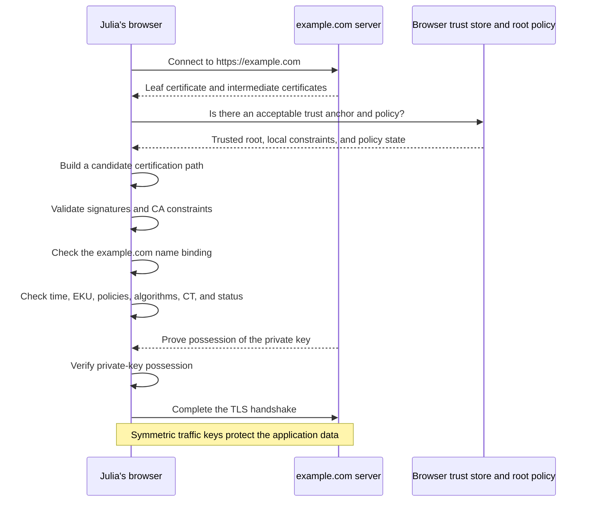

Julia's browser connects to a server claiming to be `example.com`. The server sends its leaf certificate and intermediates. It does not send the root, because the browser already holds its own trust anchors and would not accept a root just because a server offered one. The browser builds a candidate path, validates it, and asks a long list of questions: does the certificate bind this key to this name, is it within its validity period, does the path reach an accepted anchor, was each CA authorized to make the next delegation, is the key permitted for server authentication, are the algorithms acceptable, is the required Certificate Transparency evidence present, is the revocation or lifetime status acceptable. Then, separately, the server proves possession of the private key during the handshake, because the certificate alone proves nothing about who is on the wire right now. Finally, the handshake establishes symmetric traffic keys that protect the actual data.

Three distinct conclusions, worth keeping distinct because they fail independently:

1. A trusted issuer bound this public key to `example.com`.
2. The current server possesses the corresponding private key.
3. The certification path and handshake satisfy this browser's rules.

One of those checks deserves separating from the rest, because it is not part of path validation at all. Path validation asks whether the chain is acceptable. Name matching asks whether this certificate is for the thing Julia meant to reach, and a chain can be flawless while the answer is no. The client holds a reference identifier, the name it set out to contact, and compares it against the presented identifiers in the leaf certificate, which for the modern web means the Subject Alternative Name extension and not the Common Name, a field browsers stopped honoring for this purpose years ago. Two consequences are worth stating plainly. A certificate that validates to a trusted root but names a different host authenticates nothing Julia asked for. And resolving `example.com` to an address does not make that address an authenticated identity: DNS got the client to a server, and only the name binding in the certificate says whether that server is the right one.

There is also a question none of these three answers, and it matters more each year. A certificate says a key was bound to a name. It says nothing about which organization holds that key when the handshake happens. In a typical modern deployment the domain belongs to one company, its DNS is operated by another, the certificate is requested by a load balancer, and the private key lives on a CDN edge that terminates TLS on the origin's behalf. All of that can be entirely legitimate and correctly configured. It is simply a different question from the one the certificate answers, and the distinction between cryptographic, operational, and organizational boundaries in Part III applies here as much as it does to CAs.

The story so far, in one paragraph. Cryptography can prove a key was used but not who may use it. Julia cannot verify every key herself, so the web performs each verification once, through a CA, and lets everyone reuse the result. The evidence is a certificate, a signed and expiring binding of claims and entitlements to a key. Authority flows down a hierarchy from offline roots through constrained intermediates to the issuers that do the daily work, certificates form a graph with more than one path through it, and Julia's browser walks that graph in milliseconds every time she opens a page. What Part I never explained is why any of those roots deserve to sit at the top. That is not a cryptographic question at all, and it is where we go next.

---

# Part II. The Governance

## 11. The Browser Is the Trust Decision-Maker

Certificate-chain diagrams begin with a root certificate and an arrow pointing down. But that diagram begins after the most important trust decision has already been made. A root certificate is trusted because a browser, operating system, application, administrator, or user configured it as a trust anchor. The root does not make itself trustworthy by signing itself. A self-signed certificate is just a claim until someone decides to accept it.

For the public WebPKI, that acceptance is managed by browsers and operating-system platforms on behalf of their users. They maintain **root programs**, the policies, processes, and trust stores that determine which CA organizations and which roots are accepted, under what conditions, and for how long. CAs perform verification and issuance functions delegated to them under rules those platforms establish and enforce. The browser is not merely checking a chain that CAs created; it defines the trust framework within which that chain has any meaning at all.

> **The browser is the trust decision-maker. The CA is a delegated verifier and issuer. The root certificate is a configured technical anchor.**

This is the point at which the article's two structures come apart cleanly. The **cryptographic structure** (root key signs intermediate key signs issuing key signs subscriber key) expresses how authority is delegated to particular keys. Within one CA organization it looks like a hierarchy, though across the ecosystem it is really a graph, as Section 9 showed: one key can hold several certificates and several parents at once. The **governance hierarchy** (user relies on browser, browser operates root program, root program authorizes and constrains CA organization) determines who may participate, which rules apply, what evidence must be produced, who is accountable, and what happens when requirements are violated. The certificate path shows which key authorized another key. The governance hierarchy explains why the browser accepts that authority in the first place.

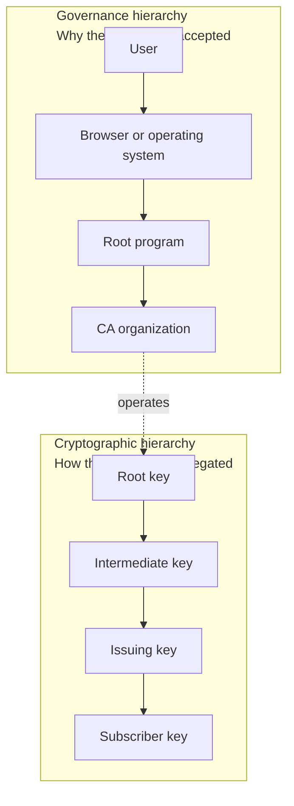

The governance claim is not settled law of nature. It is contested at the level of regulation, and the dispute is about more than who controls the trust store. It is about whether a certificate should tell you who you are dealing with.

The instrument at issue is the Qualified Website Authentication Certificate. A QWAC binds a verified legal identity, the registered company behind a site, to that site's domain, and is issued by a Qualified Trust Service Provider supervised by an EU member state. The motivation is a reasonable one. Public TLS retreated over two decades to answering a single narrow question about domain control, browsers removed the interface that displayed organization identity, and from a European consumer-protection standpoint the web lost the ability to tell a person which legal entity is on the other end of a transaction. QWACs are an attempt to put that back.

The difficulty is that the web already tried it and found the identity signal did not survive contact with reality. Extended Validation certificates carried a verified legal identity and browsers displayed the company name in the address bar. In 2017 the researcher Ian Carroll [registered a company called "Stripe, Inc" in Kentucky](https://cyberscoop.com/easy-fake-extended-validation-certificates-research-shows/), entirely legally, and obtained a valid EV certificate for it. Nothing was broken. The CA validated correctly, the company existed, the certificate was accurate, and the browser displayed "Stripe, Inc" exactly as it did for the Delaware company that processes payments. Carroll's conclusion was that any mechanism that hands a user a legal entity is fatally flawed, and browsers eventually agreed: the [identity interface was removed](https://www.troyhunt.com/extended-validation-certificates-are-really-really-dead/) from Safari and Chrome rather than repaired. The reason connects to the distinction drawn in Section 4. Company names are not globally unique and jurisdictions assign them independently, so a legal name is not a reachable identifier in the way a DNS name is. A correct binding to a legal identity still does not tell a relying party which of several identically named entities it is talking to, which means the assurance is real and the disambiguation is not.

That history does not make QWACs worthless. It does mean the EU is legislating a solution to a problem the web attempted and abandoned for reasons that have not gone away, and the regulation's answer to those reasons is largely that browsers must display and accept the result anyway.

The mechanism deserves stating precisely. In its Article 45, [eIDAS 2.0](https://eur-lex.europa.eu/legal-content/EN/ALL/?uri=CELEX%3A32024R1183) requires browsers to recognize QWACs from qualified trust service providers, and it does so wholesale. Browsers must accept every qualified CA that appears on a member state's trusted list, and each member state's own supervisory body decides which CAs in its jurisdiction go on that list and whether they come off it. Read that against everything in this Part and the inversion is complete. In the WebPKI, the trust decision-maker is the relying-party software vendor, the decision is global, and a CA answers to programs it cannot capture. Under Article 45, admission is mandatory for the browser, and removal authority sits with the government hosting the CA, which is to say with the party most invested in that CA's continued trust and least accountable to relying parties everywhere else. Twenty-seven national supervisory regimes each hold a key to recognition the law compels browsers to extend, and no root program holds the corresponding power to revoke one.

The mechanics here need stating precisely, because the defense of Article 45 usually leans on reassuring language that turns out not to bind anyone. In legal drafting, as in standards drafting, there is a difference between normative and non-normative text. Normative provisions, the articles themselves, carry words like shall and create enforceable obligations. Non-normative material, the recitals and accompanying statements, explains intent and binds no one. Article 45(1) is normative: qualified website authentication certificates "shall be recognised by providers of web-browsers," and the article adds that this recognition may not be conditioned on any mandatory requirements beyond those the article itself lays down. That second clause is the one that matters, because it forecloses exactly what root programs do: a browser cannot apply CT logging, Baseline Requirements compliance, its own validation standards, or any other condition of trust to these certificates. Article 45a is the escape hatch, and it is narrow. Precautionary measures are permitted only for substantiated concerns about identified certificates or identified sets of certificates, they carry notification obligations to the Commission and the supervisory body, and the supervisory body, the regulator responsible for the very provider in question, can ask the browser to end its measures when it confirms the provider's qualified status. Meanwhile the soothing language, that the regulation is not meant to dictate how browsers manage encryption or set their security policies, lives in recitals and Commission statements. Non-normative. When normative and non-normative text pull in different directions, only one of them is law.

Browser makers and much of the security community objected on the grounds this article has been building. Root programs' authority to constrain, monitor, and remove CAs is the mechanism that keeps the ecosystem honest, and a trust anchor mandated by law is a trust anchor that cannot be distrusted when it fails. The final text added the Article 45a carve-out and the non-normative reassurances, but the normative structure stands, and the underlying question of who is sovereign over the trust store is now a live political question, not just a technical one.

The ecosystem's answer to that impasse deserves covering, because it is this article's two-hierarchies argument playing out inside a standards body. [ETSI TS 119 411-5](https://www.etsi.org/deliver/etsi_ts/119400_119499/11941105/02.01.01_60/ts_11941105v020101p.pdf) defines two ways to deploy a QWAC. In the first, the 1-QWAC, the qualified certificate is the TLS certificate: the qualified CA sits in the handshake path, and recognition entangles the browser's trust store exactly as a plain reading of Article 45 implies. In the second, the 2-QWAC, the qualified certificate never appears in the handshake at all. An ordinary WebPKI certificate, issued and governed under everything in this Part, authenticates the domain and secures the connection, and the QWAC is a separate credential binding the verified legal identity to that TLS certificate through a signature the browser retrieves and checks against the EU trusted lists out of band. Under that model the qualified CA is trusted for the legal-identity assertion and nothing else. A malicious or compromised qualified CA can lie about who a company is. It cannot mint a certificate capable of interception, because the domain-control question was never delegated to it in the first place.

That design concedes the argument this section has been making. It pries the governance hierarchy back apart from the cryptographic one: the trust decision-maker keeps sovereignty over the TLS trust decision, and the legislated recognition is rehoused as an identity attestation layered outside the PKI that authenticates the channel, which is exactly where Section 4 argued identity belongs. The blast radius of a bad qualified CA narrows from an interception primitive to a false identity claim, and a false identity claim is a signal the web had already learned to discount. Marginally better is the honest grade, and the margin is the one that matters. Two caveats keep it from being a resolution. The standard says browsers should support both profiles, so the decoupling holds only if the implementing acts let browsers satisfy Article 45 with 2-QWACs alone rather than compelling recognition of 1-QWACs too, and that is where the sovereignty question now lives. And the 2-QWAC binding is a signature over specific TLS certificates, so it must be reissued every time the certificate beneath it rotates, a lifecycle nobody will run by hand at the validity periods Part III describes.

## 12. Root Programs, the CA/Browser Forum, and the Limits of Audit

Each browser or platform could invent completely independent CA requirements, and in the early days they roughly did, with the predictable results: duplicated work, incompatible expectations, and fragmentation for every CA trying to serve users across many products. What evolved instead is a layered system of overlapping governance, coordination, and assurance.

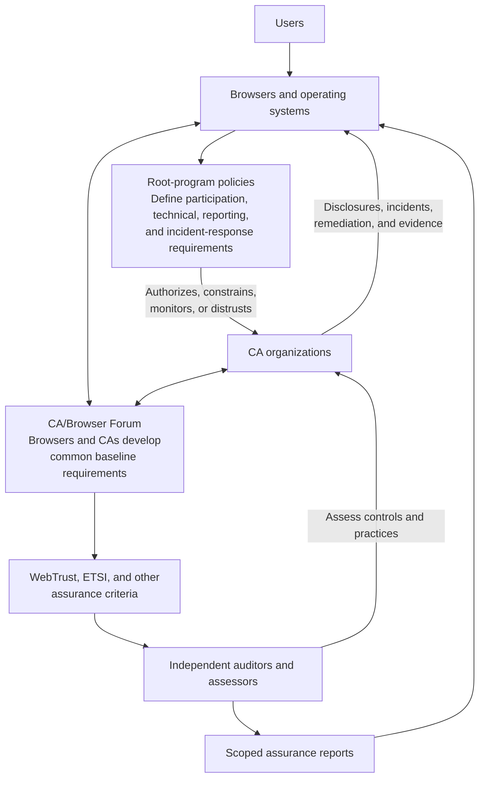

Root programs retain final authority over their own trust stores. A root program may incorporate shared industry requirements, add stricter product-specific ones, restrict particular validation methods, demand disclosures and technical controls, set incident-reporting expectations, require remediation, and remove trust entirely, including from a CA holding a current, unqualified audit report. That last point turns out to matter.

Root-program authority is also not all-or-nothing. The trust-store entry itself carries scope, and a root program decides not just whether to trust a root but for which subset of usages. A root certificate may be technically capable of anchoring anything, with no EKU restrictions and every claimed purpose in its CPS, and the platform can still record it as trusted only for TLS server authentication. Mozilla expresses this as per-root trust bits for websites and email; Microsoft assigns permitted EKUs to each root in its store; Chrome trusts roots for server TLS and nothing else. This is one of the clearest illustrations of the two-hierarchies point. The certificate says what the CA claims authority over; the trust store says what the platform accepts, and only the second one binds the relying party.

The CA/Browser Forum is the venue where certificate issuers and certificate-consuming software makers develop common requirements, and its origin is a coordination problem that ran in both directions. Before the Forum existed, each root program tried to manage expectations bilaterally with every CA it trusted, and every CA had to maintain a distinct conversation with every root program that mattered to its business. Neither side could scale that. Root program managers were negotiating the same issues over and over with dozens of CAs, and CAs were reconciling subtly different demands from every platform. The Forum gave both sides a place to work the problem once, together.

The price of getting everyone into the room was consensus, and the consequence of consensus was that the initial requirements settled at the lowest common denominator that every participant could live with. That was understood at the time, and the design intent was a ratchet: establish a floor everyone could meet, then tighten it as the ecosystem's capability improved. For public TLS, the Baseline Requirements establish shared expectations for domain validation, certificate profiles, key management, lifecycle, revocation, logging, audit, CA system security, and incident response. The Forum does not sit above root programs. Its value is alignment. The Baseline Requirements are a common floor; root programs build on top of it. When the ecosystem needed MPIC after the BGP-hijack research, the path ran through a Forum ballot into the Baseline Requirements and from there into every audit regime. That is what governance by alignment looks like when it works, and validity periods, as Part III will show, are the clearest case: the floor has been tightened again and again for over a decade, each step contested at the time and each step, in retrospect, plainly coming.

WebTrust, ETSI, and the assurance layer exist because requirements alone don't demonstrate implementation. These frameworks translate requirements into criteria that independent auditors can assess. An audit can provide evidence that, during a defined period and within a defined scope, the CA maintained controls intended to satisfy specified criteria: that practices were accurately described, requests were validated as required, keys were protected, access was controlled, and lifecycle processes operated as represented.

What an audit cannot do is guarantee that no certificate was misissued, that no system was compromised, that every requirement was interpreted correctly, that compliance persists past the audit period, or that the browser should continue to trust the CA. Auditors provide evidence; they do not make trust decisions. The public record bears this out quantitatively. As of August 2026, the record shows more than 1,500 CA compliance incidents disclosed in the public trackers since 2014, of which audits surfaced roughly seven percent. CAs' own monitoring detected about a quarter, and the rest were found by external researchers, automated CT monitors and linters, and community reports. I maintain a running analysis of this record at the [WebPKI Observatory](https://webpki.systematicreasoning.com/), and the pattern it shows is consistent year over year: the observability machinery of the next section finds far more problems than the assurance machinery of this one.

A distinction borrowed from law makes the gap precise, and it is one I have used for years. Rules are explicit and mechanically checkable. In this ecosystem the rules are the Baseline Requirements, translated into WebTrust and ETSI audit criteria and bound into contracts, and rules are what audits test. Standards are the adaptable layer above them, the community norms and expectations each root program maintains about transparency, candor, incident response, and living up to promises, and standards are what root programs actually judge. The court analogy runs deeper than a figure of speech. Root programs play a dual role. As stewards they set the requirements and decide admission; as judges they interpret ambiguity, resolve disputes, and set precedent through their public handling of incidents, which every other CA then reads the way lawyers read case law. Nobody votes for them, but their mandate is real. Users elect root programs every day through their choice of browser and operating system, and can vote them out the same way. I laid this framing out in [Why We Trust WebPKI Root Certificate Authorities](https://unmitigatedrisk.com/?p=847) while the Entrust matter was still being argued in public.

If that distinction sounds academic, the 2024 distrust of Entrust shows otherwise. Entrust, a large, long-established, fully audited commercial CA, accumulated a pattern of misissuance incidents over 2023 and 2024. None was individually catastrophic. What proved fatal was the response pattern documented in its own public incident reports: delayed revocations, commitments made and missed, and a recurring posture that treated Baseline Requirement obligations as negotiable when they were commercially inconvenient. In mid-2024 [Chrome announced](https://security.googleblog.com/2024/06/sustaining-digital-certificate-security.html) it would stop trusting Entrust TLS certificates issued after a cutoff date, and Apple and Mozilla followed with their own. Entrust's audits were current. Its cryptography was fine. What it lost was the root programs' confidence in its governance behavior, and within a year it was issuing from another CA's roots and its public certificates business had been sold. Root programs weigh disclosed incidents, Certificate Transparency data, linting results, community reports, remediation quality, and patterns of failure over time. A current audit is necessary and not sufficient. What root programs weigh most heavily is the quality and consistency of a CA's incident response. In rules-and-standards terms, Entrust's individual rule violations were each survivable and its audits stayed current; what it kept failing was the standards, and it is the standards that root programs enforce.

### Key lesson

> **Root programs decide who is trusted. The Forum aligns everyone on a common floor. Auditors produce evidence against defined criteria. Neither of the last two is a trust decision, which is how a CA holding current audits can still lose the ecosystem.**

## 13. Trust on the Internet Is Decentralized

It would be easy to read Part II so far as a story about centralization: a handful of root programs holding final authority over everyone. The structure is better understood as decentralized in several overlapping ways, and the overlaps are what keep every participant, including the root programs themselves, honest.

The first axis is the root programs. There are several, and a commercially viable public CA needs to be trusted by all four of the major ones: Mozilla, Microsoft, Apple, and Google's Chrome Root Program. Trust from three of the four is not a passing grade; it is a CA whose certificates break for a large fraction of the Internet, and the reach extends past the browsers themselves, since Mozilla's store alone feeds the trust bundles of countless Linux distributions and libraries. This has two consequences that run in opposite directions. For CAs, the effective bar is the union of all four programs' requirements, and distrust by any single program is commercially fatal, which is why the Entrust story only needed Chrome and Mozilla to end the way it did. For the root programs, the same interdependence is a constraint on them: a program whose requirements drifted far from the others would impose costs on an ecosystem every other program shares, and in practice the programs move in loose formation, with one proposing and the others evaluating. No single root program can stray too far, in either direction, without the rest of the system pulling against it.

The second axis is the distribution of the roots themselves. The trusted roots are operated by organizations spread across many countries and legal jurisdictions, which means there is no single government that can compel, subvert, or shut down the WebPKI's trust anchors as a class. The same is true at a smaller scale within countries: even domestically, roots sit in different corporate hands and different jurisdictions, so pressure applied to one operator does not reach the others.

An honest account has to note where this decentralization is thinner than it looks. As of August 2026, close to ninety CA organizations hold trust, spread across every region, but issuance concentrates dramatically: the top five CAs account for over ninety percent of currently unexpired certificates, and US-incorporated CAs, though only a minority of the trusted population, account for over ninety percent of them as well. The trust surface is decentralized; the operational reality is a handful of very large operators, most of them under one country's corporate law, with a long tail of dozens of CAs holding full trust and issuing almost nothing. Both halves of that picture matter for risk, in opposite directions. The concentration means a failure at one of the big five is a failure for a large fraction of the web, and the long tail means dozens of organizations retain the power of trusted issuance without the scrutiny that market share attracts.

The long-tail risk is not hypothetical, and neither is the unevenness among the judges. In 2025, Fina, a Croatian CA responsible for a negligible share of global issuance, was found to have [repeatedly misissued certificates for the IP address 1.1.1.1](https://blog.cloudflare.com/unauthorized-issuance-of-certificates-for-1-1-1-1/), the bootstrap endpoint for Cloudflare's encrypted DNS, and the certificates sat valid for months. Fina was trusted by Microsoft's root store but not by Chrome, Firefox, or Safari, so the exposure fell entirely on the users of the most passive of the four major programs, the one whose trust store is broadest and whose participation in public incident oversight is thinnest. Trust asymmetry between programs is itself a risk surface, and so is weak governance generally: an attacker does not need to compromise a major CA when CT logs can be mined to find a small, poorly run one that some ecosystem still trusts in full. I wrote up [that incident and what it says about root governance](https://unmitigatedrisk.com/?p=1092) at the time. The decentralized design of this section only delivers its promised resilience when every root program is actively doing the work.

The third axis is that coordination between the root programs is real but deliberately limited. There is no council that decides what the Internet trusts. What the programs share instead is a common factual record: the CCADB, the Common CA Database at ccadb.org, now operated under the Linux Foundation. The root programs populate it. Each program records its inclusions, trust settings, and status decisions there, and requires the CAs it trusts to disclose their hierarchies, subordinate CA records, audit statements, policy documents, and contact and incident data into the same system, which makes it the most authoritative shared record of who is trusted where. The ground truth of trust itself still lives in each program's own store and constraints, trust is the relying party's configuration, not the database describing it. CCADB is a shared ledger of common evidence, not a trust store and not a shared decision-maker. Each root program reads the same record and reaches its own conclusions, which is exactly the design: common evidence, independent judgment.

The evidence layer is decentralized as well. The Certificate Transparency logs described in the next section are operated by multiple independent parties, and browsers require proof of logging in logs run by more than one operator before a certificate is accepted, so no single log operator can hide, forge, or withhold the record of what was issued.

### Key lesson

> **The WebPKI has no single sovereign. Four programs decide independently, CAs must satisfy all of them, logs are independently operated, and roots sit under many jurisdictions. That is not the same as being evenly distributed: issuance is heavily concentrated, and a long tail of CAs holds trust it almost never uses.**

## 14. Certificate Transparency as a Precondition of Validity

Certificate Transparency, specified in [RFC 9162](https://www.rfc-editor.org/rfc/rfc9162.html), began as an observability project: record every publicly trusted TLS certificate in publicly auditable, append-only logs, so that domain owners, browsers, researchers, and root programs can see issuance. CT does not prove a certificate was issued correctly. It means a CA can no longer make a publicly usable certificate without leaving signed evidence with multiple independently operated public logs, which turned out to be most of the battle.

The crucial move came when the major browsers made CT evidence a **requirement for validity**. A public TLS certificate without acceptable Signed Certificate Timestamps [simply does not work in Chrome or Safari](https://support.apple.com/en-us/103214), and has not for years. That single policy decision converted transparency from a professional norm into a precondition. A CA can no longer misissue quietly; making a certificate usable creates signed evidence, held by independent log operators, that requires its publication. This is an unusual governance design. Rather than trusting CAs to report their own failures, the system was rearranged so that the evidence of every action, correct or not, is produced automatically as a side effect of the action itself.

The mechanics are what couple issuance to public accountability. Before signing the real certificate, the CA builds a precertificate, identical in content but carrying a poison extension that makes it unusable as an actual certificate. That precertificate goes to the logs, run by multiple independent operators. Each log accepts it and returns a Signed Certificate Timestamp, a signed promise to incorporate the submission into its append-only tree within the log's Maximum Merge Delay. The CA embeds those SCTs into the final certificate and signs it. Once the promised entries are merged, monitors can discover them, and a log that fails to merge on time has left signed evidence of its own misbehavior. Publication is not instantaneous, but by the time a certificate is usable the CA has already handed independent parties the evidence that compels it.

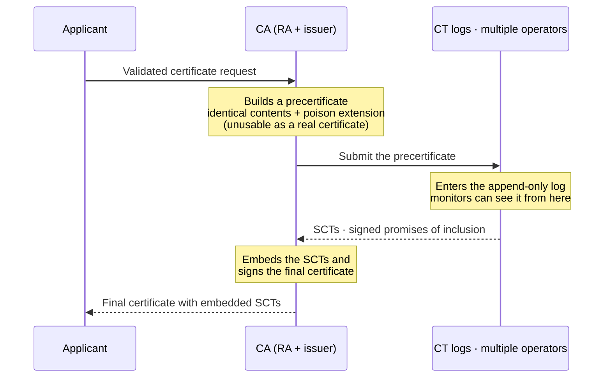

One honest limit belongs next to that achievement. CT delivers visibility, not remediation. The misissued 1.1.1.1 certificates from the previous section were in the public logs the whole time and stayed valid for months anyway, because logging a certificate does nothing unless someone is watching for it and a pipeline exists from alert to revocation. CT delivers detection, not remediation.

On top of the logs sits an ecosystem of consumers. Domain owners and their vendors monitor for certificates naming their domains and brands from unexpected issuers. Automated linters, run by researchers, by root programs, and by CAs against their own output, flag malformed certificates, prohibited algorithms, profile violations, and policy defects, and frequently surface systemic CA bugs from a single logged certificate. Public incident reporting in the Mozilla and Chrome trackers turns those findings into documented cases with root-cause analysis that the whole community, including competing CAs, reviews. Root programs read all of it.

### Key lesson

> **Delegation without observability is blind trust. For public TLS the ecosystem fixed that by making the evidence a precondition of the certificate being useful at all. The other public PKIs still run on the old arrangement.**

## 15. How Domain Owners Restrict Issuance

Everything so far has described constraints imposed from above: root programs constraining CAs, CAs constraining subordinates. **CAA (Certification Authority Authorization)**, defined in [RFC 8659](https://www.rfc-editor.org/rfc/rfc8659.html), is the one mechanism that lets the domain owner restrict which CAs may issue for their name. The domain owner publishes a DNS record declaring which CAs are permitted to issue for that domain, and CAs have been required to check and honor it since 2017.

CAA is easy to underrate and just as easy to overrate, so be precise about what it buys. It does not restrain a fully malicious CA: one willing to ignore CAA is willing to lie about having checked it, though CT will record the result either way. As Emily Stark puts it in [her post on why CT is not a replacement for key pinning](https://emilymstark.com/2022/08/23/certificate-transparency-is-really-not-a-replacement-for-key-pinning.html), CAA offers essentially no direct technical security value against an adversary; its value is protection against the non-adversarial mistakes CAs make, and CAs make a great many of those. What it does, then, is narrow the attack surface by policy of the party with the most at stake. With close to ninety CA organizations trusted across the major root programs (the [CCADB](https://www.ccadb.org/) lists considerably more root certificates than owners, since many owners operate several roots, and the meaningful unit for CAA is the owner), a domain owner who uses two of them can declare the rest off limits, converting "any trusted CA anywhere can be tricked into issuing for my domain" into "an attacker must defeat the specific CAs I chose." In an ecosystem defined by delegation downward, CAA is the reminder that the subject of all this verification is allowed to express intent too: machine-readably, enforceably, and in advance.

### Key lesson

> **CAA is the one standardized, machine-readable control that runs from the named party upward into the CA ecosystem. It will not stop a dishonest CA. What it does is reduce how many CAs have to be honest for your domain to be safe.**

An earlier mechanism was stronger. HTTP Public Key Pinning let a site declare the specific keys that must appear in its chain, and browsers would reject any certificate for that host that did not include one, no matter which trusted CA had issued it. That is a real defense against a malicious or compromised CA, which is exactly what CAA and Certificate Transparency are not. It was also brittle in a way that punished its users: a site that rotated to a key it had not pinned, or lost the pinned key, took itself off the web for the duration of the pin, and enough operators did that to make the feature untenable. Browsers removed it. CT and CAA together cover much of the same ground from different directions, detection after the fact and restriction before it, but neither restores the guarantee pinning offered. CT and CAA are weaker guarantees that fail safely. Pinning was a stronger guarantee that failed catastrophically when misconfigured.

The story so far, continued. The roots are trusted because browsers and platforms chose them, through root programs that hold final and unilateral authority, scoped by usage, exercised in public. The rules are aligned through the CA/Browser Forum, checked by auditors who provide evidence rather than verdicts, recorded in the CCADB, enforced by mandatory transparency, and constrained from below by domain owners through CAA. The design is decentralized on purpose, and it is under political challenge on purpose too. Part III is about what all this machinery is actually for: the days when the certificates all validate and something is still wrong.

---

# Part III. When the Hierarchies Diverge

## 16. The Certificate Can Be Valid but Wrong

A certificate may be structurally perfect and cryptographically well-formed while still being improperly issued. The CA may have validated a domain incorrectly. An attacker may have compromised DNS, or a registrar account, or the email address the validation relied on, or the BGP path the validation traffic took. A validation implementation may contain a defect. An intermediate may have exceeded its authority. A subscriber's key may be stolen. A malicious root may be installed locally.

The signature proves that the CA issued the certificate. It cannot prove that the CA should have.

> **Cryptographic validity proves that a key signed an object. It does not prove that the signer had a sound factual or policy basis for doing so.**

This is the gap between the two structures in its purest form. The cryptographic delegations are fully intact, every signature verifies, and the governance hierarchy has failed somewhere out of sight. The rest of Part III is about how that gap opens, how it is detected, and how it is closed.

## 17. Delegation Creates Agency Risk

The user does not observe CA validation decisions. The browser delegates that work, and the interests, incentives, systems, and competence of the delegate are never perfectly aligned with those of relying parties. The resulting risks are the familiar ones: incorrect validation, weak operational controls, overly broad authority, slow incident response, incomplete disclosure, commercial incentives at odds with ecosystem safety, self-serving interpretation of ambiguous requirements, and shared internal systems that undermine the segmentation the certificates advertise.

That delegation stops earlier than the certificate hierarchy makes it look. In practice the overwhelming majority of subordinate CAs in the public WebPKI are operated by the same organization that operates the root above them. They are internal segmentation: one purpose here, one customer population there, one algorithm or region somewhere else, all under the same policies, the same personnel, the same audits, and the same accountability to root programs. The delegation that matters in that arrangement is the one from the browser to the CA organization. Everything below it is that organization dividing its own authority.

Externally operated subordinates, where a CA delegates issuance to a different organization, are the exception, and the ecosystem has spent fifteen years making them rarer and more constrained. That is not an accident. The delegation Symantec could not supervise ran to partners it did not control, and much of the modern apparatus, from mandatory disclosure of every subordinate CA to technical name and purpose constraints, exists to make that arrangement visible when it happens and survivable when it fails.

Sound delegation therefore requires constraints, monitoring, transparency, auditing, incident reporting, corrective action, and the credible possibility of distrust. Every one of those mechanisms exists in the modern WebPKI because some CA, at some point, demonstrated the need for it.

> **Trust should not mean assuming that delegates never fail. It should mean having mechanisms to constrain, detect, correct, and respond to their failures.**

## 18. Four Failures That Built the Modern System

The WebPKI's governance machinery was not designed in advance. Most of it was added in response to specific incidents. Four of them motivated nearly everything in Part II, and are worth the detail.

The first is DigiNotar in 2011, the only case where a CA's failure ended the company outright. Attackers compromised the Dutch CA and issued more than five hundred rogue certificates, including a wildcard for `google.com` that was used to intercept the traffic of hundreds of thousands of users in Iran. The compromise was not detected by DigiNotar, whose internal detection and disclosure failed comprehensively. Chrome's key pinning for Google properties refused the rogue certificate, but the ecosystem learned of the attack only because a user in Iran posted the resulting browser error to a help forum. Detection was, in the end, luck. Browsers removed DigiNotar from their trust stores entirely. The company was bankrupt within weeks, and because it also served the Dutch government's PKI, parts of the government's digital infrastructure went down with it. DigiNotar established the precedents the ecosystem still runs on: distrust is real and can be total; a CA's detection and disclosure behavior matters as much as the breach itself; and the ecosystem could not keep depending on a pin catching the attack and a stranger happening to report it. That last requirement became Certificate Transparency.

The second is TURKTRUST, discovered at the end of 2012, where a configuration error handed out CA authority by accident. The Turkish CA accidentally issued two intermediate CA certificates where end-entity certificates were intended, a profile mix-up in a test environment that escaped into production. One of the two ended up in a corporate TLS-inspection firewall, which used its CA authority to mint a `*.google.com` certificate for interception, at which point Chrome's pinning again raised the alarm. There was no malice at the CA, but the incident demonstrated that a single profile-configuration error can silently hand out the power to impersonate anyone. It motivated the modern emphasis on certificate linting, constrained profiles, technically enforced EKU and name constraints on intermediates, and disclosure of all subordinate CAs to root programs.

The third is Symantec, removed between 2015 and 2018 after an accumulation of process failures. The largest commercial CA of its era was found to have issued unauthorized test certificates for domains including Google's. The subsequent investigation kept widening, ultimately covering tens of thousands of certificates whose validation, performed through inadequately supervised regional partners, could not be relied upon. No single event was DigiNotar-scale. What condemned Symantec was the pattern of repeated failures, partial disclosures, and remediation that root programs no longer believed. Because Symantec certificates were a huge fraction of the web, immediate distrust was impossible; Chrome and Mozilla instead executed a staged, dated distrust across browser releases, giving subscribers time to migrate while making the endpoint non-negotiable. Symantec exited by selling its CA business to DigiCert. The incident proved distrust could scale to the largest participants, established the staged-distrust playbook, and stands as the definitive demonstration that delegated validation authority is only as strong as its weakest, least-supervised delegate.

The fourth is Entrust in 2024, covered in Part II and included here because it completes the arc by showing that a CA's governance behavior alone can end its trust. No compromise, no attacker, current audits, distrusted anyway, on the documented quality of its incident response. If DigiNotar taught the ecosystem that CAs can be removed for being breached, Entrust taught it that CAs can be removed for being unaccountable.

Four incidents, one trajectory: each demonstrated that continued trust depends on operational governance rather than cryptographic correctness alone. The full record confirms that these four are representative rather than exceptional. Sixteen CAs have been removed from the browser trust stores since DigiNotar, and fourteen of the sixteen were removed for compliance and operational failures, patterns of unresolved issues, concealment, or inadequate incident response, not for cryptographic compromise. The median runway from a CA's first documented compliance incident to its distrust is over three years, which says something uncomfortable about how much patience the ecosystem extends before acting.

The shape of these failures is consistent. A CA is seldom distrusted for one issue. It is almost always a long history of minor issues, each individually survivable, culminating in larger ones and in the exhaustion of root-program patience, which is what that three-year median runway is actually measuring. The exception is government-affiliated CAs. They tend to arrive opaque, disclose little, and hold clean, compliant audit reports right up to the end, and the end is characteristically a single unforgivable event: a certificate or intermediate that enables interception. ANSSI, the French government CA, had trust restricted in 2013 after a subordinate certificate turned up in a traffic-inspection appliance. CNNIC was removed in 2015 after an intermediate it issued was misused to mint unauthorized certificates for interception. India's NIC in 2014 fits the same one-event shape. In the record to date, commercial CAs have generally been distrusted after accumulated governance failures, while government-affiliated CAs have more often lost trust after a single interception event. I keep a running catalog of these events and their patterns in [Exploring Browser Distrust](https://unmitigatedrisk.com/?p=850).

That record has a practical consequence for everyone who relies on a CA. Since DigiNotar, sixteen CAs have been removed from the browser trust stores in roughly fifteen years, about one a year; counted as root-program actions rather than individual CAs, since some actions removed more than one, it averages out to a distrust event approximately every 1.25 years, per the catalog cited above. Either way, distrust happens often enough that any subscriber should plan for replacing a CA. It is a routine ecosystem event that happens on someone else's schedule, and any subscriber's CA can be the next one. That is the strongest argument for standardizing on ACME and treating the CA as a swappable supplier: in a genuinely portable deployment, with CAA records, account setup, and challenge types kept CA-agnostic, a distrust event can approach a configuration change, a new directory URL and a reissue, rather than a rebuild of your certificate lifecycle. Combine a distrust every year or so with validity periods heading to 47 days and the conclusion is unavoidable. Automated certificate lifecycle management is no longer an optimization for sophisticated operators. It is operationally necessary.

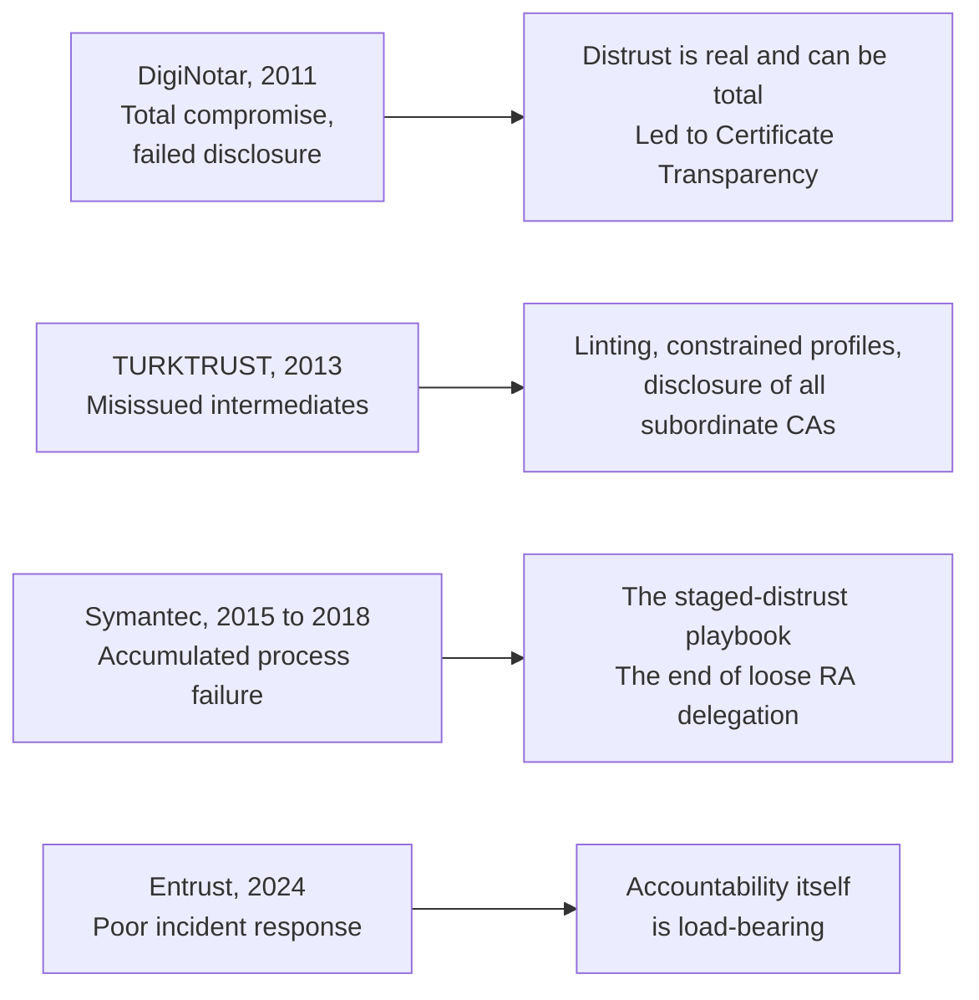

## 19. Failure Boundaries and Blast Radius

What actually fails when a CA fails depends on which boundary contained the failure. A subscriber-key compromise affects one certificate. An issuing-key compromise potentially affects everything that key ever signed. A validation-system compromise affects every issuer that shares the validation system, regardless of how separate their keys are. An intermediate compromise permits unauthorized issuance within, at best, the intermediate's constrained scope. A root compromise threatens an entire hierarchy and requires trust-store changes on every relying device. An organizational failure, as with Symantec and Entrust, can span every root and issuer the organization operates, even when the cryptographic keys were impeccably separated.

This is why mature CA organizations segment issuers by purpose, validation method, customer population, region, algorithm, and assurance level. Segmentation creates the possibility of revoking one issuer without touching the rest. But certificate separation is not operational separation. Several issuers might still share one validation service, one set of administrative accounts, one HSM partition, one network, one issuance codebase, one on-call rotation. The certificate hierarchy shows formal delegation of authority. It does not reveal the real operational blast radius. Incident response, and root-program review of it, is largely the discipline of finding out which boundaries actually held.

### Key lesson

> **Cryptographic separation, operational separation, and organizational separation are three different things. Incident response is largely the work of finding out which of them actually held.**

## 20. The Death of Revocation, and What Replaced It

Issuing a certificate distributes an authorization statement to the world. Revoking it requires withdrawing that statement from everywhere it landed, promptly, before it is relied upon again. A certificate may need revocation because a key was compromised, issuance was improper, the subscriber lost control of the identifier or the authorization, the issuing CA itself was compromised, or the certificate violates policy.

The classical mechanisms were Certificate Revocation Lists, periodically published lists the relying party downloads, and [OCSP](https://www.rfc-editor.org/rfc/rfc6960.html), an online protocol for asking the CA about one certificate's status in real time. OCSP was the validation authority from the passport analogy in Part I: the border agent phoning the issuing country to ask whether this particular passport is still good. Both mechanisms failed at web scale, and the manner of failure matters. CRLs grew large and stale. OCSP failed in a more instructive way. A hard-fail OCSP check makes every CA's responder infrastructure a global availability dependency for the entire web, so browsers soft-failed instead, treating an unreachable responder as approval. But a soft-fail check provides little real security: the attacker positioned to use a stolen certificate is generally positioned to block a status lookup. OCSP also leaked browsing activity to CAs by design, and stapling, in which the server delivers its own recent OCSP response, never achieved the coverage needed to change the default. The 2014 Heartbleed incident was the empirical stress test. A single OpenSSL bug made the private keys of a large fraction of the web potentially extractable at once, which meant every affected key had to be treated as compromised, and the correct response, revoke and reissue everything affected, collided with every weakness above at the same time: CRLs ballooned, OCSP infrastructure strained, and browsers, which had long since defaulted to soft-fail, could not actually deliver the revocations to relying parties. The machinery built for exactly that scenario could not handle it. After two more decades' worth of lessons compressed into that one event, the ecosystem stopped pretending. OCSP has been deprecated in the [Baseline Requirements'](https://cabforum.org/working-groups/server/baseline-requirements/requirements/) direction of travel, and Let's Encrypt, the largest issuer on Earth, [shut its OCSP responders down entirely in 2025](https://letsencrypt.org/2025/08/06/ocsp-service-has-reached-end-of-life).

What replaced online checking is a two-part design, and neither part looks like classical revocation.

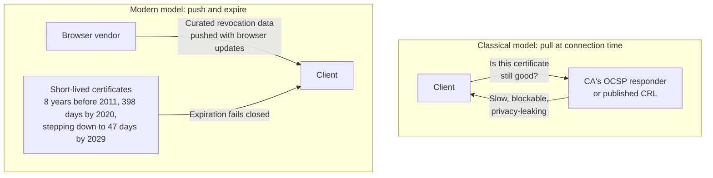

The first part replaces pull with push, and that shift is already complete. No mainstream browser performs live revocation checks by default for ordinary public certificates. Not CRL fetching, not OCSP. The surviving exceptions have been narrow and shrinking, historically tied to EV certificates, which are now a low single-digit share of public TLS issuance and falling; [Radar's validation-level and certificate-duration views](https://radar.cloudflare.com/certificate-transparency) show both that share and the lifetime glide path as they move. For the certificate on essentially any site you visit, nothing is fetched from the CA at connection time.

What happens instead is that the browser vendor does the fetching, on its own schedule, from its own infrastructure. CAs are required to disclose their CRL endpoints through CCADB; the vendors crawl those CRLs, filter them to what matters, compress the result aggressively, and ship it to clients through the same update channel that delivers the trust store itself. That is Chrome's [CRLSets](https://www.chromium.org/Home/chromium-security/crlsets/), and Mozilla's OneCRL for intermediates alongside [CRLite's](https://blog.mozilla.org/en/firefox/crlite/) compressed encoding of essentially all known revocations for Firefox. The relying party never asks anyone a question at connection time; the browser vendor has already curated the answer and shipped it. Note who gained power in that redesign: the trust decision-maker, again.

None of this shortening is arbitrary, and none of it is new. Every key has an effective cryptoperiod, a window over which it is prudent to rely on it, derived from assumptions about how strong the underlying cryptography is and how well the key is generated, stored, used, and managed. The guidance literature has quantified this for decades, and [keylength.com](https://www.keylength.com/) collects the recommendations from NIST, ECRYPT, and the other bodies in one place. A certificate's validity period is a reliance decision layered on top of a cryptoperiod judgment, and when the assumptions change, whether about algorithm strength, key handling, or the operational environment, the window should change with them. Anyone new to this ecosystem who is startled by shortening validity periods has simply not been paying attention. Lifetimes have been shortening for decades, and every step is the same adjustment: bring the period over which the world relies on a binding into line with the risks and operational realities actually present.

The descent in certificate lifetimes has been long and deliberate. Maximum public TLS lifetimes were eight years before 2011, then five, then three in 2015, then two in 2018. In 2020, after a ballot to the same effect had failed at the CA/Browser Forum, Apple simply announced that Safari would reject certificates valid longer than 398 days, and the rest of the industry complied, a clean preview of the unilateral root-program power this article keeps returning to. I said publicly in 2023 that a shorter-lifetime ballot was only a matter of time and that the moment to automate was before it arrived, not after. The ballot that arrived, proposed fittingly by Apple, went past the 90 days everyone had been arguing about, straight through to 47, and passed without a single opposing vote.

The second part shrinks the window, and the ordering of cause and effect matters here. Short lifetimes were not invented to paper over failed revocation. Their primary benefits are the ones the cryptoperiod argument implies. They limit how long a compromised key remains useful to an attacker, and they let the ecosystem change algorithms, profiles, and policy on a human timescale instead of a decadal one. Reduced dependence on revocation is the architectural consequence, and a welcome one. The deeper answer is therefore to make revocation matter less by making certificates live less. If a certificate expires in days, the maximum exposure from a compromise that goes undetected is days. Expiration becomes the revocation of last resort, and it is the one mechanism that fails closed everywhere. This is now explicit, [balloted policy](https://cabforum.org/2025/04/11/ballot-sc081v3-introduce-schedule-of-reducing-validity-and-data-reuse-periods/). Maximum public TLS lifetimes are stepping down from 398 days to 200, then 100, and by decade's end to 47 days, with domain-validation reuse windows shrinking alongside. None of this would be operable by humans with calendars. It is only possible because ACME made issuance a background process. In passport terms, the ecosystem stopped trying to make the phone call to the issuer work and instead did two things: the border agent's own government now hands its agents a curated list of revoked passports, and passports expire so quickly that a revoked one barely has time to be a problem. Short lifetimes also buy something beyond limiting stolen-key exposure. At any point in time, the web is roughly 24 hours away from a key-compromise or invalid-validation event that puts millions of certificates on a mandatory revocation clock: the Baseline Requirements impose a 24-hour deadline for key compromise and for unauthorized issuance (meaning issuance whose domain-control evidence can no longer be relied upon, so the certificate may be in the wrong hands entirely), with a five-day outer limit for most other misissuance, the profile and policy defects in certificates that still went to the right party, and a Heartbleed-class bug or a CA incident can start that clock for a huge population of certificates at once. An organization that has automated its way to 47-day renewal has, as a side effect, rehearsed the exact drill a mass-revocation event demands. Stated plainly: distributed, real-time revocation checking does not work at Internet scale, and the need for it is being engineered out of existence. The VA is the one classical PKI role the WebPKI has effectively retired.

The SHA-1 migration is the classic demonstration of how much harder removal is than granting, and of a failure mode this article has not yet named, which is non-web systems depending on public WebPKI roots without participating in the WebPKI's migrations. By the mid-2010s SHA-1 had become too weak to keep using in TLS signatures, the Baseline Requirements banned new issuance from the start of 2016, and browsers prepared to reject SHA-1 certificates outright. Then the payment industry surfaced. Fleets of payment terminals had been hard-coded to trust specific WebPKI CAs, even though those terminals never spoke to a browser and could just as easily have depended on a private PKI, and they had shipped with no mechanism for updating their roots or their certificates. The entanglement was specific: those terminals used client authentication certificates from the same hierarchies that issued server certificates, so a change aimed at the web reached straight into the payment network. Deprecating SHA-1 for the web meant preventing those terminals from processing payments, and that was too high a bar to enforce on schedule. So the migration bent. In 2016, with root-program reluctance on full public display, exceptions were granted for new SHA-1 issuance to keep terminal fleets alive after the ban, Worldpay's being the publicly litigated case. The lesson generalizes well beyond one hash function. Every un-updateable device that depends on public WebPKI roots without participating in the ecosystem's migrations can delay the next one, and the WebPKI's agility is bounded by its least maintained dependent. It is also one of the strongest arguments for keeping non-web systems on private PKIs, where their lifecycle constraints bind only themselves.

### Key lesson

> **Withdrawing widely distributed trust is harder than granting it, so the ecosystem stopped relying on being able to. Shorter lifetimes limit how long a compromised key is worth anything and let migrations happen on a human timescale; needing revocation less is the consequence.**

## 21. Local Trust Can Override Public Trust

Everything described so far concerns the default trust configuration shipped by browser and platform vendors. It is not the only source of trust on a real device. Additional roots are installed by enterprises, both for internal services and, commonly, for TLS-inspecting proxies that re-sign the entire web on the fly. They are installed by security products, by device manufacturers, by users following instructions of varying wisdom, and by malware, for which a trust-store write is total victory over TLS.

A locally installed root authorizes certificates the public WebPKI would never accept, invisibly to the governance machinery of Part II: no CT logging, no root-program oversight, no linting, no incident reports. Sometimes that is exactly the legitimate point, as with an enterprise inspecting its own managed endpoints. Sometimes it is the threat model itself. In 2019, Kazakhstan instructed citizens to install a government root certificate so that national ISPs could intercept HTTPS traffic. The browser vendors responded by blocklisting that specific certificate in their products, refusing connections it signed even on machines whose owners had installed it. This was an instructive collision. The local trust store is normally sovereign over the browser's defaults, and here the browsers asserted that their governance responsibility extends to overriding a local configuration when it exists to enable mass surveillance.

### Key lesson

> **A browser decides using the trust configuration it actually has, which is not always the one its vendor shipped. The local trust store is among the most powerful and least observed security boundaries on any machine.**

---

# Part IV. Boundaries

## 22. There Is More Than One PKI

The WebPKI is one trust system among many, and the same X.509 machinery serves them all. Two distinctions organize the landscape better than a flat list. The first is the usage, meaning which question is being delegated and which attribute is being bound. The second is the trust domain, meaning whether the certificates are meant to be relied upon by the public at large, under some cross-organizational governance regime, or only within a private domain that sets its own rules. Most usages exist on both sides of that line, with the same certificate formats and completely different governance.

| Usage | Public trust domain | Private trust domain |
| --- | --- | --- |
| TLS server authentication | Public TLS, the WebPKI itself, governed by browser root programs, the Baseline Requirements, and CT | Private TLS on enterprise roots, serving internal services and infrastructure |
| Email protection (S/MIME) | Public S/MIME, governed by the CA/Browser Forum S/MIME Baseline Requirements and the mail clients' trust stores | Private S/MIME for enterprise mail on internal CAs |
| Code signing | Public code signing under the Code Signing Baseline Requirements, anchored above all by Microsoft's root program | Private code signing for build, release, and firmware pipelines on internal roots |
| Document signing | Public document signing through Adobe's Approved Trust List and the EU trusted lists under eIDAS | Private document signing inside internal approval and records workflows |
| TLS client authentication | Ending for public issuance on a dated schedule: new subordinate CAs under Chrome-trusted roots must be serverAuth-only since June 2026, newly issued leaves carrying clientAuth fail validation in Chrome as server certificates from March 2027, and CAs are dropping the EKU ahead of the deadline | Private client auth for enterprise access, VPN, and mTLS between organizations |
| Workload identity | Essentially none | Private workload PKIs issuing short-lived service identities |
| Device identity | Industry consortium PKIs for cable modems, Wi-Fi, and smart-home ecosystems | Private device PKIs for manufacturer and fleet identity |

The delegated question changes with the row: is this key authorized for this DNS name, associated with this email address, authorized to sign for this publisher, assigned to this employee or workload, provisioned into a device with the asserted provenance. The governance changes with the column. In every public column entry, the same allocation of roles appears with different organizations filling them. The relying-software vendor is the trust decision-maker, whether that is a browser for TLS, a mail client for S/MIME, an operating system for code signing, or a document reader and a regulation for signatures. In the private column, one organization plays every role at once, which is simpler and also removes every external check described in Part II. Some ecosystems sit between the columns, as with the consortium device PKIs, where an industry body plays root program for its members.

One asymmetry runs across the public column. Certificate Transparency is a predicate of trust only on the web. A public TLS certificate that is not logged does not function; a public code-signing, S/MIME, or document-signing certificate that is misissued is invisible until it is abused, because none of those ecosystems has a CT equivalent. The web learned, through the incidents in Part III, that delegation without observability becomes blind trust, and rebuilt itself around mandatory transparency. The other public PKIs have the same delegation structure, the same agency risks, and none of the observability, which will matter whenever one of them suffers a comparable failure and the response gets debated.

The client-authentication row is the one that changed most recently, and the next section takes it up on its own.

This is why there is no universal meaning of "trusted certificate." A certificate has meaning only within a defined trust domain, namespace, policy, relying application, and set of validation rules. The most common category of PKI misuse in practice is not broken cryptography. It is a certificate from one trust domain being accepted, or assumed meaningful, in another, and the payment terminals that held the SHA-1 migration hostage in Part III are the expensive proof.

## 23. What Happened to Client Authentication

One row in that table changed decisively while this post was being written, and it is worth following, because it is the article's arguments playing out in real time.

For most of the WebPKI's history, a publicly trusted certificate could carry both serverAuth and clientAuth in its Extended Key Usage, issued from the same hierarchy, and plenty did. The convenience was obvious: one certificate, one supplier, one procurement process, usable for a server identifying itself to browsers and for a machine identifying itself to another machine. The cost was entanglement, and the ecosystem has now decided the cost was too high.

Chrome's root program requires hierarchies in its store to be dedicated to TLS server authentication, and the requirement lands on a dated schedule rather than all at once. Since June 2025 it has not accepted inclusion applications from hierarchies that are not dedicated, since June 2026 any new subordinate CA disclosed under its roots must assert serverAuth alone, and from March 2027 every newly issued leaf carrying clientAuth will fail validation in Chrome as a server certificate. Note what that last step is and is not. It is not a distrust in this article's sense, because no trust anchor is touched. And it is not a decision about client authentication at all, because a browser validates server certificates and was never a relying party for clientAuth; that judgment belongs to whatever terminates the mTLS connection, which no browser root program governs. Chrome is enforcing a profile on the one question it answers, and that alone is enough, because a dual-purpose certificate that stops working in browsers is commercially useless. The other major programs are aligned, and the CAs are moving ahead of the deadline: Sectigo stopped including clientAuth by default in September 2025, Let's Encrypt removed it through its ACME profiles, and DigiCert has announced its sunset for March 2027. Publicly trusted certificates that work for both purposes are ending, on a schedule with a published end date.

That is the right outcome, and the reason runs through Part III of this post. The SHA-1 migration stalled in part because payment terminals authenticated using client certificates from the same roots that issued server certificates, so a change aimed at the web reached into the payment network and stopped there. The same pattern has repeated since with enterprise communications gear using one certificate for both directions of an mTLS session. Every time server and client authentication share a hierarchy, one use case can hold the other hostage during a migration. Dedicated hierarchies are how you stop that, and it is the same blast-radius argument that Section 6 made about roots.

The harder question is where the displaced use cases go. Internal client authentication, VPN access, device onboarding, mTLS between your own services, belongs on private PKI, which was always the better answer: you control the profiles, the lifetimes, and the revocation, and your blast radius stops at your own organization. Authentication with a handful of known partners works the same way, by exchanging trust anchors directly, which is how those integrations should have been built to begin with. Using a public certificate there was a false economy, because it quietly widened the trust boundary to every entity that could buy a certificate from the same CA.

What has no clean answer is authentication across organizational boundaries at a scale where you cannot pre-configure anchors for every counterparty. That is the problem public server authentication solves in one direction, and it is becoming more common rather than less as machines, and increasingly automated agents, transact across organizations that have no prior relationship. Sector-specific frameworks address parts of it, such as DigiCert's X9 PKI for finance or eIDAS in Europe, but nothing addresses the general case, and private PKI by definition cannot.

If something does eventually fill that gap, two constraints from earlier in this post apply directly. Identity would have to live in the Subject Alternative Name using reachable identifiers, DNS names or URIs of the kind SPIFFE already uses for service identity, rather than in the Distinguished Name inherited from a directory that never existed. And the relying party would still have to treat the result as authentication, not authorization: a publicly trusted client certificate tells you which entity controls a name, not whether that entity should have access to anything. I have written [at more length about that gap and what a narrow version might look like](https://unmitigatedrisk.com/?p=1225).

### Key lesson

> **Public client authentication ended because it was entangled with server authentication, and entanglement made both harder to change. Internal and partner use cases belong on private PKI. Cross-organizational machine authentication at Internet scale is a real gap with no general answer today.**

## 24. What Comes Next

The classical WebPKI described in this post is being redesigned right now, and the forcing function is post-quantum cryptography. Post-quantum signatures and keys are an order of magnitude larger than their classical counterparts, and a TLS handshake today carries a leaf, an intermediate, signatures over each, CT evidence, and a handshake signature. Translate all of that to post-quantum algorithms and the transmitted chain grows by more than ten kilobytes per connection. Private PKIs can absorb that cost. Their operators control the relying parties, the connection volumes are bounded, and swapping algorithms inside the classical chain architecture is the sensible move, which is why PQ-ready classical PKI will be the norm off the web for a long time. The public web cannot absorb it. At billions of handshakes a day, against hard latency budgets and a client population nobody fully controls, the per-connection signature chain stops being viable, and the question the ecosystem has not seriously asked in thirty years gets asked: is a chain of signed certificates, transmitted in full on every connection, actually the right way to convey an attribute binding?

For the web, the answer taking shape is Merkle Tree Certificates, and every trend covered in this post points toward the assumptions that design makes: relying parties continuously updated by their vendors, trust material distributed through the trust decision-maker's own channels, automation as a precondition, and validity windows short enough that recently issued and currently valid nearly coincide. [The Post-Quantum WebPKI](https://rmhrisk.github.io/pq-webpki/) covers that architecture in depth. The short version is that the governance hierarchy, which has been gaining power in every revision of the classical system, becomes an explicit part of the wire protocol.

## 25. What PKI Can and Cannot Establish

PKI can help a relying party determine that an issuer signed a certificate; that the certificate binds a key to specified attributes for specified uses during a specified period; that a certification path reaches an accepted anchor and satisfies defined constraints; that the endpoint possesses the corresponding private key; and that required transparency evidence exists.

PKI does not establish that the website is honest, that the content is true, that the service is secure, that the software is safe, that the private key was never copied, that the CA followed every procedure, that the endpoint is uncompromised, that the identifier means what the user assumes it means, or that the binding remains appropriate a moment after issuance.

> **A certificate is a signed, scoped, and time-bounded binding of claims and entitlements to a public key. It is evidence used in a trust decision, and the decision is not the mathematics.**

## 26. Practical Exercise

Inspect a real website's certificate. Every browser exposes it, though browser viewers hide most of what is there; paste the certificate into [x509.io](https://x509.io/) and you will see the whole structure, extensions included. Identify: the DNS names bound to the key, the public key and algorithm, the issuing CA, the intermediates, the root your browser selected, the validity period (and note how short it is compared to a few years ago), the Key Usage and EKU, the certificate policies, the embedded Certificate Transparency SCTs, and whatever revocation pointers remain.

One certificate tells you about one binding. For the shape of the ecosystem it came from, spend an afternoon in two dashboards. [Cloudflare Radar's Certificate Transparency view](https://radar.cloudflare.com/certificate-transparency) reports what is actually being issued right now: the mix of validation levels, the distribution of certificate lifetimes, which CA owners account for what share of issuance, and how issuance spreads across CT log operators. The [WebPKI Observatory](https://webpki.systematicreasoning.com/) covers the governance side over time: who holds trust, the disclosed compliance incidents and who found them, and the distrust record. Between them you can check nearly every empirical claim in this post against current data rather than taking my word for it.

Then ask the questions the certificate cannot answer for you. Which organization operates the issuer, and under which root programs? What authority was delegated to that issuer, and which constraints limit it, in the certificate and in policy? Which browser or platform chose the root, and when did it last review that choice? Search a CT monitor for the site's domain: who else has issued for it, and would its owner know? Check whether the domain publishes CAA records, and whether they match the issuer you found. Finally: if this issuing key were compromised tonight, which of the mechanisms in Part III would actually protect you, and how long would each one take?

## 27. In Review

Twenty-odd sections is a lot to hold, so here is the spine one more time. Cryptography proves possession of a key, never authorization to use it, so the web has CAs check control and record the result in signed, expiring certificates that everyone else reuses. The cryptographic delegations carry that authority downward under constraints that narrow at every step, across a graph with more than one path through it. The governance hierarchy, browsers and their root programs, decides whose authority counts at all, judging by standards as much as rules, in public, with the CCADB as the shared record and Certificate Transparency required before a certificate works at all. When the two hierarchies diverge you get certificates that are valid but wrong, and the incident record, a distrust roughly every 1.25 years, is why revocation gave way to push-and-expire, why lifetimes are collapsing toward 47 days, and why automated lifecycle management stopped being optional. Private PKIs will carry the classical model into the post-quantum era. The web's scale will not allow it, and the Merkle Tree Certificate architecture that replaces it is [the next post](https://rmhrisk.github.io/pq-webpki/).

## Final Takeaway

> **PKI does not eliminate the need to decide whom to trust. It makes those decisions scalable: by delegating verification, binding claims and entitlements to keys, constraining authority through hierarchy and policy, and placing the final decision in relying-party software. The certificate graph records how authority is delegated. The governance hierarchy determines whether relying parties accept that authority, and when they withdraw it. Judge any PKI, and any proposed change to one, by how honestly it accounts for the gap between the two.**
